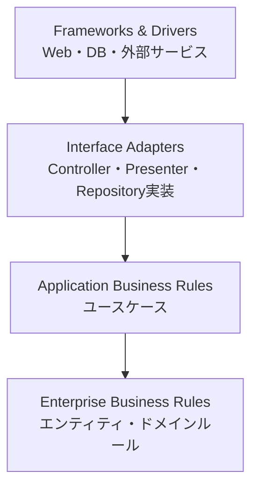
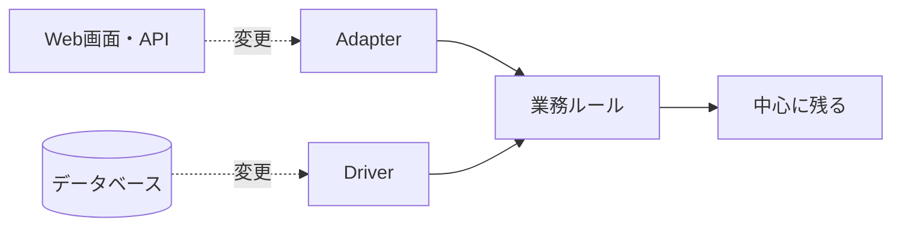
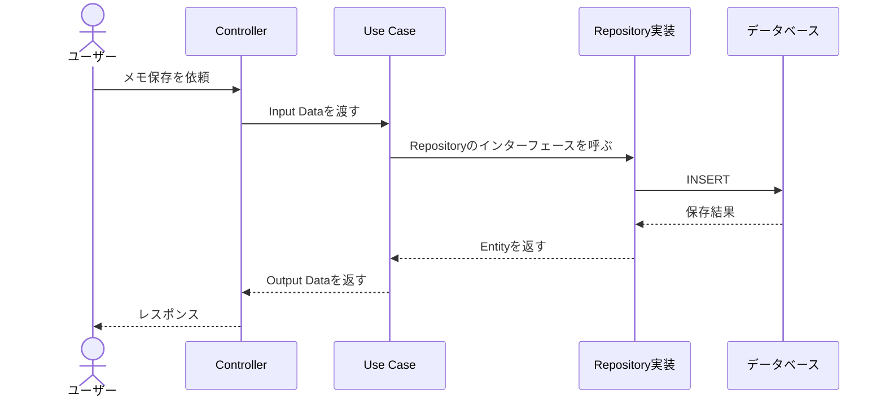
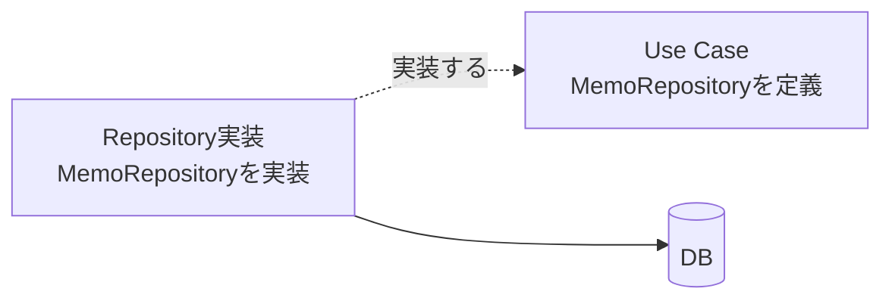
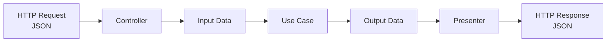
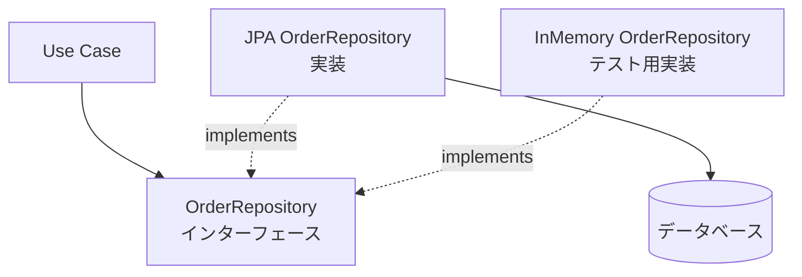
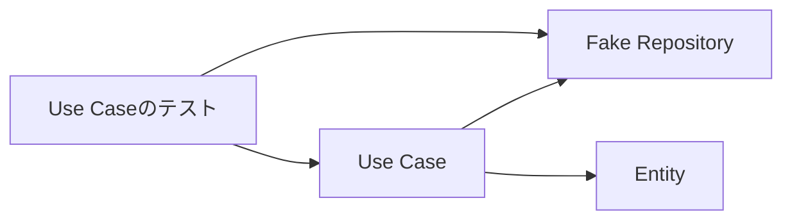

# Clean Architecture勉強用基礎資料

## 1. Clean Architectureとは

Clean Architecture（クリーンアーキテクチャ）は、**業務ルールを、画面・データベース・フレームワークなどの変更から守るための設計方法**です。

アプリケーションを、責任の異なる同心円状の層に分けます。中心に近いほど、業務上重要で、長く使いたいルールを置きます。



Clean Architectureの目的は、フォルダーをきれいに分けることではありません。
**中心のコードが、外側の具体的な仕組みを知らなくてよい状態を作ること**が重要です。

## 2. なぜ必要なのか

最初は、Controllerからサービスを呼び、サービスからRepositoryを呼ぶだけでもアプリを作れます。
しかし、次のような変更が重なると、コード全体が変更に弱くなります。

- Web画面をスマートフォンアプリや別のAPIへ変更する
- データベースを変更する
- 外部決済サービスを別のサービスへ変更する
- 業務ルールを変更する
- データベースなしでユースケースをテストする

例えば、業務ルールの中にSQLやHTTPの処理が混ざっていると、データベースの変更だけで業務ルールまで修正する必要があります。

Clean Architectureでは、依存関係を整理して、次のような変更を外側に閉じ込めます。



## 3. 最も重要なルール：依存性のルール

Clean Architectureで最も大切なのは、**ソースコードの依存は外側から内側へ向ける**というルールです。

```text
Frameworks & Drivers
        ↓
Interface Adapters
        ↓
Use Cases
        ↓
Entities
```

内側の層は、外側の層のクラス名やフレームワークを知りません。
例えば、`UseCase`が`Spring`、`HttpServletRequest`、`JPA EntityManager`などに直接依存しないようにします。

### 3.1 呼び出しの流れと依存方向は異なる

実行時には、画面からController、Use Case、Repository実装、データベースの順に処理が進みます。
一方、コードの依存方向は、Use Caseが定義したインターフェースを外側のRepository実装が実装することで、内側へ向けられます。





このように、**処理の実行時の流れ**と**ソースコードの依存方向**を分けて考えます。

## 4. 4つの層

### 4.1 Entities（エンティティ）

Entitiesは、アプリケーション固有の業務ルールを表す層です。

- 注文、会員、商品などの業務上の概念
- 金額、期間、メールアドレスなどの値に関するルール
- 複数の画面やユースケースで共通する、重要な業務ルール

Entitiesは、画面、データベース、Webフレームワークを知りません。
同じ業務ルールを複数のユースケースで使う場合、Entitiesに置くと重複を防げます。

例えば注文自身が「確定後は変更できない」というルールを持ちます。

```java
public class Order {
    private final String id;
    private OrderStatus status = OrderStatus.DRAFT;

    public Order(String id) {
        if (id == null || id.isBlank()) {
            throw new IllegalArgumentException("注文IDは必須です");
        }
        this.id = id;
    }

    public void confirm() {
        if (status != OrderStatus.DRAFT) {
            throw new IllegalStateException("確定済みの注文は再確定できません");
        }
        status = OrderStatus.CONFIRMED;
    }

    public OrderStatus status() {
        return status;
    }
}
```

### 4.2 Use Cases（ユースケース）

Use Casesは、**利用者が達成したい目的ごとのアプリケーション処理**を表す層です。

例えば次のような処理です。

- 注文を作成する
- 注文を確定する
- メモを保存する
- 会員を登録する

Use Caseは、処理の順序を組み立てます。
しかし、画面表示やSQL文を担当するものではありません。

例えば「注文を確定する」Use Caseは、次の処理を行います。

1. 入力された注文IDを受け取る
2. Repositoryから注文を取得する
3. 注文の`confirm`を呼び出す
4. Repositoryへ保存する
5. 結果をOutput Boundaryへ渡す

```java
public class ConfirmOrderUseCase {
    private final OrderRepository orderRepository;

    public ConfirmOrderUseCase(OrderRepository orderRepository) {
        this.orderRepository = orderRepository;
    }

    public void execute(String orderId) {
        Order order = orderRepository.findById(orderId)
            .orElseThrow(() -> new IllegalArgumentException("注文が見つかりません"));

        order.confirm();
        orderRepository.save(order);
    }
}
```

`OrderRepository`は、Use Case側が必要とする約束として定義します。

```java
public interface OrderRepository {
    Optional<Order> findById(String orderId);
    void save(Order order);
}
```

### 4.3 Interface Adapters（インターフェースアダプター）

Interface Adaptersは、外側の形式と内側の形式を変換する層です。

- Controller：HTTPリクエストをInput Dataへ変換する
- Presenter：Output Dataを画面やJSONへ変換する
- Repository実装：データベースのデータをEntityへ変換する
- Gateway：外部APIの形式をUse Caseが扱える形式へ変換する

例えば、ControllerはJSONの項目をそのままUse Caseへ渡すのではなく、Use Case専用の入力データへ変換します。
これにより、Use CaseがHTTPやJSONの形式に依存しません。

### 4.4 Frameworks & Drivers（フレームワークとドライバー）

Frameworks & Driversは、最も外側にある具体的な仕組みです。

- Spring BootやRailsなどのWebフレームワーク
- MySQLやPostgreSQLなどのデータベース
- ORMやデータベースドライバー
- メール、決済、認証などの外部サービス
- ファイルシステムやメッセージキュー

この層は便利ですが、変更される可能性が高い部分です。
そのため、業務ルールをこの層へ漏らさず、接続処理にできるだけ限定します。

## 5. 境界を越えてデータを渡す

層の境界を越えるときは、専用のデータ形式を使います。
このデータ形式を、Input DataやOutput Data、Data Transfer Object（DTO）などと呼びます。



ControllerがデータベースのEntityをそのままJSONにして返すと、DBの列名や内部構造が外部へ漏れます。
また、EntityにWeb用のアノテーションを追加すると、内側の業務ルールがフレームワークへ依存します。

境界ごとに変換することで、次の変更に対応しやすくなります。

- APIの項目名を変更する
- DBのテーブル構造を変更する
- 内部Entityの属性を増減する
- 同じUse Caseを別のUIから呼び出す

## 6. 依存性逆転の原則（DIP）

通常は、上位の処理が下位の具体的なクラスを直接呼び出します。
しかし、Use CaseがDB実装へ直接依存すると、テストやDB変更が難しくなります。

そこで、Use Case側にインターフェースを定義し、外側の実装がそれを実装します。
これが依存性逆転の原則（Dependency Inversion Principle、DIP）の代表的な使い方です。



同じインターフェースに対して、本番用とテスト用の実装を差し替えられます。
このとき、インターフェースは単なる技術的な都合ではなく、内側が外側へ要求する「ポート」と考えられます。

## 7. フォルダー構成の例

Javaで注文APIを作る場合の一例です。

```text
src/main/java/com/example/order/
├─ domain/
│  ├─ Order.java
│  └─ OrderStatus.java
├─ application/
│  └─ confirmorder/
│     ├─ ConfirmOrderUseCase.java
│     ├─ ConfirmOrderInput.java
│     └─ ConfirmOrderOutput.java
├─ adapter/
│  ├─ in/web/
│  │  └─ OrderController.java
│  └─ out/persistence/
│     ├─ JpaOrderRepository.java
│     └─ OrderDataMapper.java
└─ infrastructure/
   └─ configuration/
      └─ UseCaseConfiguration.java
```

プロジェクトによって、`domain`を`entity`、`adapter`を`interfaces`など別の名前にすることもあります。
名前やフォルダーの形よりも、依存性のルールが守られていることが重要です。

## 8. テストしやすさ

中心のEntityやUse Caseが、Webサーバーやデータベースを起動しなくてもテストできることは、Clean Architectureの大きな利点です。



例えば、`InMemoryOrderRepository`を渡せば、DBの状態に左右されずに「注文が確定する」「確定済み注文は変更できない」といったルールを確認できます。

テストを分けると、問題の場所も見つけやすくなります。

| テストの種類 | 確認すること | 外部依存 |
| --- | --- | --- |
| Entityテスト | 業務ルールが守られるか | なし |
| Use Caseテスト | 処理の順序や結果が正しいか | FakeやMock |
| Adapterテスト | HTTPやDBとの変換が正しいか | 必要に応じて使用 |
| E2Eテスト | システム全体がつながるか | 実環境に近い構成 |

## 9. Clean Architectureと他の設計との関係

### 9.1 Layered Architectureとの関係

Layered Architectureは、Presentation、Application、Domain、Infrastructureのように役割ごとに層を分けます。
Clean Architectureも層を分けますが、特に**依存方向を内側へ向け、業務ルールを外部技術から守ること**を強調します。

### 9.2 DDDとの関係

DDDは業務を中心にモデルを作る考え方です。
Clean Architectureは、その業務モデルやユースケースを、UIやDBから独立させる構造として組み合わせられます。

```text
Clean Architecture
└─ 業務ルールとユースケースを中心に置く構造

DDD
└─ 業務を理解し、モデルとして表現するための考え方
```

Clean Architectureを採用したからといって、必ずDDDのすべてのパターンを使う必要はありません。

### 9.3 MVCとの関係

MVCのControllerは、Clean Architectureでは主にInterface Adaptersの外側に位置します。
Controllerがすべての業務処理を担当するのではなく、Use Caseへ処理を依頼します。

```text
Controller（MVC）
    ↓
Use Case（Clean Architecture）
    ↓
Entity / Domain Rule
```

## 10. よくある失敗

### 10.1 フォルダーだけを分ける

フォルダーを`controller`、`service`、`repository`に分けても、Controllerが業務ルールを持ち、ServiceがSQLを書いていれば依存関係は整理されていません。
どの層が何を知ってよいかを確認します。

### 10.2 Entityをデータベースの行にする

DBのテーブルをそのままEntityとみなすと、Entityが永続化の都合に引きずられます。
業務ルールを表すEntityと、DBへ保存するデータモデルを分ける方法を検討します。

### 10.3 Use Caseを巨大なサービスにする

すべての処理を1つの`OrderService`に集めると、どの目的の処理か分かりにくくなります。
「注文を確定する」「注文をキャンセルする」のように、利用者の目的単位でUse Caseを分けます。

### 10.4 何でもインターフェースにする

すべてのクラスにインターフェースを作ると、コードを読むためのファイルが増えます。
外部との境界や、差し替え・テストが必要な箇所を中心に抽象化します。

### 10.5 小さなアプリに複雑な構成を持ち込む

Clean Architectureは、常に多くの層やDTOを作るためのルールではありません。
アプリの規模や変更の可能性に応じて、必要な境界から始めます。

## 11. 学習・導入の手順

初めて取り入れるときは、次の順番で進めると理解しやすくなります。

1. アプリの利用者が達成したい目的を、ユースケースとして書き出す
2. ユースケースに必要な業務ルールをEntityやドメインモデルへ置く
3. Use Caseの入力と出力を定義する
4. DBや外部APIへの依存をインターフェースの外側へ追い出す
5. ControllerやRepository実装で、外側の形式と内側の形式を変換する
6. EntityとUse Caseを、外部サービスなしでテストする
7. 最後にフレームワークと具体的な設定を接続する

「最初からすべてを分離する」のではなく、変更されやすい外部部分と、守りたい業務ルールの境界を見つけることから始めます。

## 12. まとめ

Clean Architectureは、**業務ルールとユースケースをアプリケーションの中心に置き、外側の技術から独立させる設計方法**です。

```text
Entities              = 重要な業務ルール
Use Cases             = 利用者の目的を達成する処理
Interface Adapters    = 外部形式と内部形式の変換
Frameworks & Drivers  = Web・DB・外部サービスなどの具体的な仕組み
Dependency Rule       = 依存は外側から内側へ向ける
```

覚えておきたいポイントは次の3つです。

1. 最も重要な業務ルールを、画面やデータベースから守る
2. 処理の流れとソースコードの依存方向を分けて考える
3. パターンやフォルダー構成を目的にせず、変更しやすさとテストしやすさを目指す

まずは、注文やメモ保存など1つのユースケースを選び、入力・業務ルール・出力・外部接続を分けて図にするところから始めましょう。
