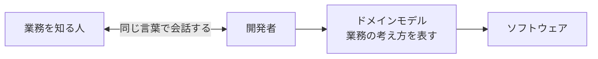
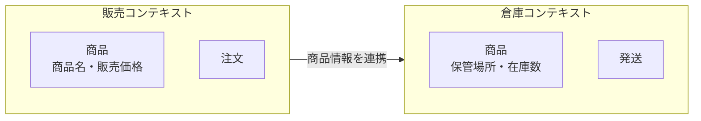
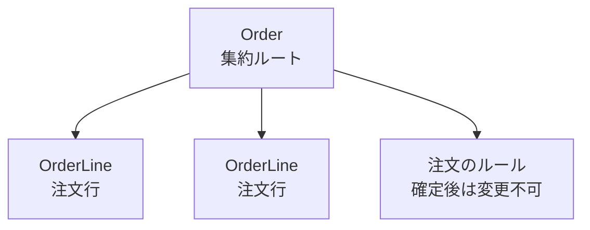
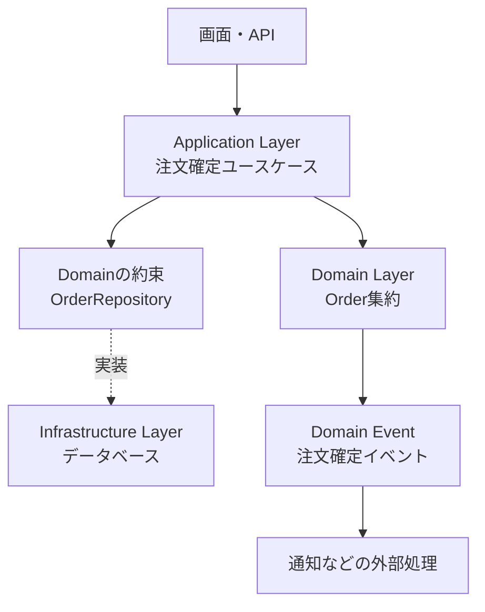
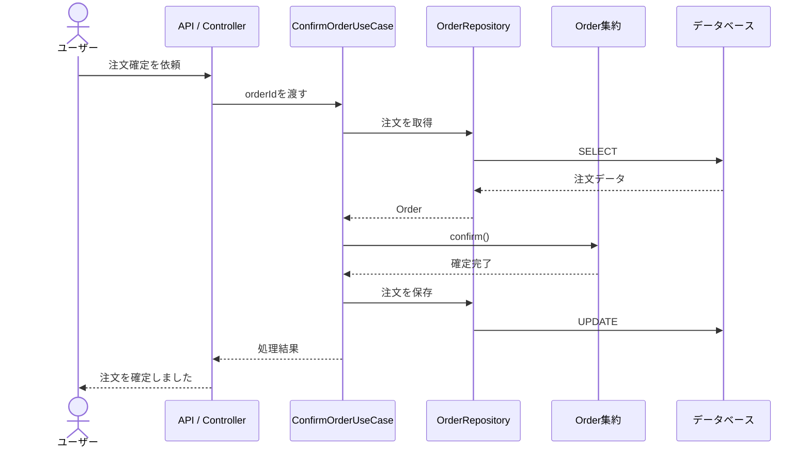

# DDD勉強用基礎資料

## 1. DDDとは

DDD（Domain-Driven Design、ドメイン駆動設計）は、**アプリケーションが扱う業務（ドメイン）を中心に設計する方法**です。

ここでいうドメインとは、単なるデータではなく、アプリケーションが解決しようとしている仕事の領域です。

例えば、ネットショップなら次のようなものがドメインになります。

- 商品を販売する
- 注文を受け付ける
- 在庫を管理する
- 支払いを確認する
- 商品を発送する

DDDでは、プログラムの都合からクラスを作り始めるのではなく、業務をよく知る人と開発者が会話しながら、業務の考え方をモデルにします。



DDDの目的は、難しい名前のクラスを増やすことではありません。
**業務のルールを正しく理解し、変更に強いソフトウェアとして表現すること**が目的です。

## 2. ドメインを見つける

### 2.1 業務上の関心ごとを整理する

最初に、「このシステムは何をするものか」を考えます。

例えば図書館システムなら、次のような業務があります。

| 業務 | 考えること |
| --- | --- |
| 貸し出し | 本を借りられる条件は何か |
| 返却 | いつまでに返す必要があるか |
| 延長 | どのような場合に延長できるか |
| 予約 | 貸し出し中の本を予約できるか |

「本」というデータを保存するだけでは、図書館の業務を表したことにはなりません。
「延滞中の利用者は新しい本を借りられない」のような**業務ルール**を見つけることが重要です。

### 2.2 ユビキタス言語

ユビキタス言語（Ubiquitous Language）は、業務を説明する人と開発者が共有する言葉です。

例えば、注文を取り消すことを、ある人は「キャンセル」、別の人は「返品」と呼んでいると、会話やコードの意味がずれてしまいます。

そこで、言葉の意味をチームでそろえます。

| 用語 | 意味の例 |
| --- | --- |
| 注文 | 購入者が商品を購入するために作成したもの |
| 確定 | 注文内容と金額が決まり、変更できない状態にすること |
| キャンセル | 発送前の注文を取り消すこと |
| 発送済み | 商品を配送業者へ渡した状態 |

決めた言葉は、会話だけでなくクラス名、メソッド名、画面の表示にも使います。
同じ言葉を使うと、コードを読んだときに業務の意味を思い出しやすくなります。

### 2.3 境界づけられたコンテキスト

同じ言葉でも、業務の場所によって意味が変わることがあります。

例えば「商品」は、販売では価格や商品名が重要ですが、倉庫では重さや保管場所が重要です。
すべての機能で1つの巨大な`Product`を共有すると、異なる業務のルールが混ざります。

このように、**モデルを適用する範囲を区切った境界**を、境界づけられたコンテキスト（Bounded Context）と呼びます。



コンテキストごとにモデルを分けると、各チームは自分の業務に合った言葉とルールを保ちやすくなります。

## 3. DDDのモデルを作る

### 3.1 エンティティ（Entity）

エンティティは、属性の値が変わっても**識別子によって同じものだと判断できるもの**です。

注文の金額や状態が変わっても、注文番号が同じなら同じ注文です。

```text
注文番号 = ORD-001、状態 = 作成中
        ↓ 金額や状態が変わる
注文番号 = ORD-001、状態 = 確定
```

この例では、`ORD-001`が注文を識別するIDです。

### 3.2 値オブジェクト（Value Object）

値オブジェクトは、IDではなく**値そのものが同じかどうか**で判断するオブジェクトです。

金額、メールアドレス、住所、期間などがよく使われます。
文字列や数値をそのまま使わず、意味のある型にすることで、値に関するルールを一か所に集められます。

```java
public record Money(int amount, String currency) {
    public Money {
        if (amount < 0) {
            throw new IllegalArgumentException("金額は0以上でなければなりません");
        }
        if (currency == null || currency.isBlank()) {
            throw new IllegalArgumentException("通貨を指定してください");
        }
    }

    public Money add(Money other) {
        if (!currency.equals(other.currency())) {
            throw new IllegalArgumentException("異なる通貨は加算できません");
        }
        return new Money(amount + other.amount(), currency);
    }
}
```

`Money`を使うと、「金額が負にならない」「異なる通貨を足さない」といったルールを、利用する側が毎回確認しなくてよくなります。

### 3.3 集約（Aggregate）

集約は、関連するオブジェクトをひとまとまりにして、**整合性を守る単位**です。
集約の外部から変更できる入口を、集約ルート（Aggregate Root）と呼びます。

例えば注文集約では、`Order`を集約ルートにします。
注文行を外部から直接変更させず、`Order`のメソッドを通して変更すると、「確定後は商品を追加できない」のようなルールを守れます。



集約を大きくしすぎると、一度の更新で多くのデータをロックすることになります。
最初からすべてを1つの集約に入れるのではなく、**同時に守る必要があるルールの範囲**で分けます。

### 3.4 ドメインサービス

ドメインサービスは、特定のエンティティや値オブジェクトだけに置くと不自然な業務ルールを表します。

例えば、2つの口座にまたがる「送金」は、送金元だけの責任とも送金先だけの責任とも言いにくいため、ドメインサービスとして表現できます。

ただし、何でもサービスに移すと、エンティティがデータだけの入れ物になります。
まずはエンティティや値オブジェクトに自然に置けるルールをそこへ置き、それが難しい場合にドメインサービスを検討します。

## 4. 注文ドメインのコード例

注文を作成し、商品を追加して確定する処理を考えます。

### 4.1 注文（集約ルート）

```java
public class Order {
    private final String id;
    private final List<OrderLine> lines = new ArrayList<>();
    private OrderStatus status = OrderStatus.DRAFT;

    public Order(String id) {
        if (id == null || id.isBlank()) {
            throw new IllegalArgumentException("注文IDは必須です");
        }
        this.id = id;
    }

    public void addLine(String productId, int quantity, Money unitPrice) {
        if (status != OrderStatus.DRAFT) {
            throw new IllegalStateException("確定後の注文は変更できません");
        }
        lines.add(new OrderLine(productId, quantity, unitPrice));
    }

    public void confirm() {
        if (lines.isEmpty()) {
            throw new IllegalStateException("商品がない注文は確定できません");
        }
        status = OrderStatus.CONFIRMED;
    }

    public OrderStatus status() {
        return status;
    }
}
```

`Order`自身が状態変更の条件を確認しているため、呼び出し側がルールを知りすぎなくて済みます。
`OrderLine`のリストも外部へそのまま公開せず、注文を変更する操作を`Order`に集めます。

### 4.2 注文行

```java
public record OrderLine(String productId, int quantity, Money unitPrice) {
    public OrderLine {
        if (productId == null || productId.isBlank()) {
            throw new IllegalArgumentException("商品IDは必須です");
        }
        if (quantity <= 0) {
            throw new IllegalArgumentException("数量は1以上でなければなりません");
        }
    }
}
```

数量が1以上というルールを、注文行を作る場所で必ず確認しています。

## 5. アプリケーションの構成

DDDは、特定のフレームワークやフォルダー構成を強制するものではありません。
ただし、次のようにドメインを中心へ置く構成がよく使われます。



### 5.1 アプリケーションサービス

アプリケーションサービス（ユースケース）は、処理の順序を組み立てる役割です。

「注文を取得する」「商品を追加する」「注文を保存する」といった流れを担当します。
一方で、「確定後は変更できない」「商品がない注文は確定できない」という業務ルールは、`Order`に任せます。

```java
public class ConfirmOrderUseCase {
    private final OrderRepository orderRepository;

    public ConfirmOrderUseCase(OrderRepository orderRepository) {
        this.orderRepository = orderRepository;
    }

    public void execute(String orderId) {
        Order order = orderRepository.findById(orderId)
            .orElseThrow(() -> new IllegalArgumentException("注文が見つかりません"));

        order.confirm();
        orderRepository.save(order);
    }
}
```

### 5.2 リポジトリ

リポジトリは、集約を保存・取得するための約束です。
ドメイン側ではデータベースの種類を意識せず、インターフェースだけを定義できます。

```java
public interface OrderRepository {
    Optional<Order> findById(String orderId);
    void save(Order order);
}
```

SQLやORMの具体的な処理は、Infrastructure Layerの実装に閉じ込めます。
これにより、テストではインメモリ実装を使い、本番ではデータベース実装を使うことができます。

### 5.3 ドメインイベント

ドメインイベントは、ドメインで重要な出来事が起きたことを表します。

```text
注文が確定した
    ├─ 在庫を確保する
    ├─ 確認メールを送る
    └─ 売上集計へ通知する
```

注文の確定処理にメール送信や集計処理を直接すべて書くと、注文のルールと外部処理が強く結び付きます。
「注文が確定した」という出来事を通知し、必要な処理を別の担当へ任せる方法があります。

## 6. DDDでの処理の流れ



この流れでは、APIは入力と出力に集中し、ユースケースは処理の順序を組み立て、`Order`は自分の状態を正しく保ちます。

## 7. 戦略的設計と戦術的設計

DDDの考え方は、大きく2つの視点に分けて整理できます。

| 視点 | 考えること | 代表的な概念 |
| --- | --- | --- |
| 戦略的設計 | どの業務をどのモデルで扱うか | ドメイン、サブドメイン、境界づけられたコンテキスト、コンテキストマップ |
| 戦術的設計 | モデルをコードでどう表現するか | エンティティ、値オブジェクト、集約、リポジトリ、ドメインサービス |

先にクラスの種類を決めるのではなく、まず業務の境界と言葉を整理します。
そのうえで、必要な場所にエンティティや値オブジェクトを使います。

## 8. DDDの利点

### 8.1 業務ルールを見つけやすい

業務の言葉をクラス名やメソッド名に使うため、コードから「何のための処理か」を読み取りやすくなります。

### 8.2 ルールの重複を減らせる

「金額は負にできない」「確定後は注文を変更できない」といったルールを、値オブジェクトや集約に集められます。

### 8.3 変更の影響を抑えやすい

データベースや画面の変更と、業務ルールの変更を分離しやすくなります。

### 8.4 業務担当者と会話しやすい

ユビキタス言語を使うと、仕様書だけでなく、コードそのものを会話の材料にできます。

## 9. 注意点とよくある失敗

### 9.1 名前だけDDDにしない

`Entity`や`Repository`という名前を付けただけでDDDになるわけではありません。
重要なのは、業務ルールが適切なモデルに置かれていることです。

### 9.2 データベースのテーブルをそのままモデルにしない

テーブルの列をすべて持つだけのクラスでは、業務上の制約を守れないことがあります。
「この状態で何ができるか」をモデルの操作として表現します。

### 9.3 集約を大きくしすぎない

すべての関連データを1つの集約に含めると、更新が遅くなり、変更の影響範囲も広がります。
一つのトランザクションで一緒に守るべきルールを基準に考えます。

### 9.4 何でもドメインサービスにしない

ドメインサービスに処理を集めすぎると、エンティティがただのデータ入れになります。
状態と、その状態を変更するルールが自然に結び付くなら、エンティティのメソッドにします。

### 9.5 小さなアプリに複雑さを持ち込みすぎない

DDDはすべてのクラスを細かく分けるためのルールではありません。
業務ルールが単純な場合は、まず分かりやすい構成で作り、複雑さが現れたところからモデルを育てます。

## 10. Layered ArchitectureやMVCとの関係

DDDは「何を中心に設計するか」という考え方です。
Layered Architectureは「責任をどの層に分けるか」、MVCは「ユーザーとのやり取りをどう分けるか」を整理します。

そのため、これらは組み合わせて使えます。

```text
Presentation Layer
└─ Controller / View（MVC）

Application Layer
└─ 注文確定ユースケース

Domain Layer
└─ Order（Entity・Aggregate）
   Money（Value Object）
   OrderRepository（インターフェース）

Infrastructure Layer
└─ OrderRepositoryのデータベース実装
```

DDDで大切なのは、Domain Layerを単なるデータ置き場にせず、業務ルールの中心として扱うことです。

## 11. 学習を始める手順

初めてDDDを学ぶときは、次の順番で考えると理解しやすくなります。

1. アプリが解決する業務を一文で説明する
2. 業務担当者が使う言葉を集め、意味をそろえる
3. 業務上の出来事とルールを書き出す
4. モデルの境界を決める
5. エンティティ、値オブジェクト、集約を見つける
6. ユースケースとリポジトリを組み合わせる
7. ルールをモデルのテストで確認する

例えば注文なら、まず次のようなルールを文章にします。

```text
商品が1つ以上なければ注文を確定できない。
確定した注文は変更できない。
数量は1以上でなければならない。
```

その後で、これらのルールを`Order`や`OrderLine`のメソッドとして表現します。

## 12. まとめ

DDDは、業務を中心にソフトウェアを設計する方法です。

```text
ドメイン             = アプリが扱う業務の領域
ユビキタス言語       = チームで共有する業務の言葉
境界づけられたコンテキスト = モデルを適用する範囲
エンティティ         = IDで同一性を判断するもの
値オブジェクト       = 値そのものに意味とルールを持たせるもの
集約                 = 整合性を守るためのまとまり
```

覚えておきたいポイントは次の3つです。

1. 先に業務の言葉とルールを理解し、後からコードへ表現する
2. 業務ルールを、できるだけドメインモデル自身に持たせる
3. DDDのパターンを目的にせず、変更に強く理解しやすい設計を目指す

まずは身近な「注文」「図書館の貸し出し」「タスク管理」などを題材にして、業務ルールを文章にするところから始めましょう。
