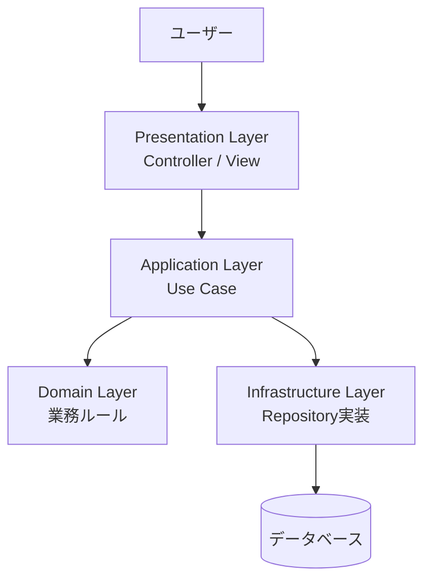
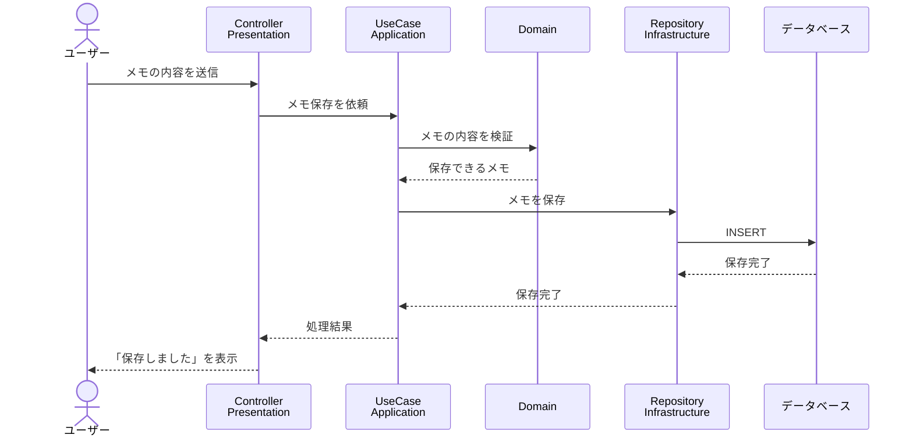

# Layered Architecture勉強用基礎資料

## 1. Layered Architectureとは

Layered Architecture（レイヤードアーキテクチャ）は、アプリケーションを**役割ごとの層（Layer）に分けて整理する設計方法**です。

大きなアプリでは、画面の処理、業務ルール、データベースへのアクセスなどを1つのファイルに書くと、何がどこにあるのか分かりにくくなります。

そこで、仕事の種類ごとに層を分けます。

```text
画面やHTTP通信を扱う層
        ↓
アプリケーションの処理を進める層
        ↓
業務上のルールを扱う層
        ↓
データベースや外部サービスと接続する層
```

Layered Architectureの目的は、単にフォルダーを分けることではありません。
**それぞれの層が担当する仕事を明確にし、変更の影響を小さくすること**が目的です。

## 2. 身近なたとえ：レストラン

レストランの仕事を、次のように分けて考えてみます。

| 層 | レストランでのたとえ | アプリでの役割 |
| --- | --- | --- |
| Presentation | 注文を聞き、料理を渡す店員 | 画面やHTTPリクエストを扱う |
| Application | 注文全体を進める責任者 | 処理の手順を組み立てる |
| Domain | 料理の作り方や店のルール | 業務ルールを表す |
| Infrastructure | 食材の仕入れや道具 | DBや外部サービスと接続する |

お客さんが「カレーを注文したい」と言ったとき、店員が直接食材の仕入れまで担当する必要はありません。
担当ごとに仕事を分けることで、料理のルールや仕入れ方法を変更しても、注文を受ける部分への影響を抑えられます。

## 3. 代表的な4つの層

### 3.1 Presentation Layer（プレゼンテーション層）

ユーザーとの入り口を担当する層です。

- HTTPリクエストを受け取る
- 入力値を読み取る
- 入力値の形式を確認する
- 画面やHTTPレスポンスを作る
- 利用者向けのエラーメッセージを返す

Webアプリでは、Controllerや画面の処理がこの層に置かれることが多いです。

ただし、**注文金額の計算や「在庫がなければ注文できない」といった業務ルールを、Presentation Layerに書きすぎない**ようにします。

### 3.2 Application Layer（アプリケーション層）

ユーザーの目的を達成するために、処理の順番を組み立てる層です。

例えば「商品を注文する」処理なら、次のような流れを担当します。

1. 注文に必要な情報を受け取る
2. 商品を取得する
3. 注文できるか業務ルールに確認する
4. 注文を作成する
5. 注文を保存する

Application Layerは、処理の**進行役**です。
一方で、「割引率はいくつか」「在庫数を超えて注文できるか」といった細かい業務ルールは、Domain Layerに任せます。

### 3.3 Domain Layer（ドメイン層）

アプリケーションが扱う業務そのものを表す層です。

- 商品、注文、会員などの業務上の概念
- 金額や日付などの値
- 「注文金額は0円以上でなければならない」などのルール
- 「在庫がなければ注文できない」などの判断

Domain Layerは、データベースやWeb画面の都合をできるだけ知りません。
そのため、保存先がSQLデータベースから別の仕組みに変わっても、業務ルールを再利用しやすくなります。

### 3.4 Infrastructure Layer（インフラストラクチャ層）

アプリケーションの外部にある仕組みと接続する層です。

- データベースへの読み書き
- 外部APIの呼び出し
- ファイルへの保存
- メール送信
- 現在時刻や乱数など、外部環境に依存する処理

Infrastructure Layerは、Application LayerやDomain Layerが必要とするインターフェースを実装することがあります。
例えば、Application Layerが「注文を保存する方法」を`OrderRepository`として定義し、Infrastructure Layerがそれを使ってデータベースに保存します。

## 4. 層の関係と依存方向

典型的な処理の流れは、外側から内側へ進みます。



ただし、「処理が呼び出される順番」と「依存してよい方向」は同じとは限りません。

レイヤードアーキテクチャでは、一般に次のようなルールを決めます。

```text
Presentation → Application → Domain
                       ↘ Infrastructure
```

- PresentationはApplicationを利用する
- ApplicationはDomainを利用する
- InfrastructureはDomainやApplicationが定めたインターフェースを実装する
- DomainはPresentationやデータベースの具体的な仕組みに依存しない

重要なのは、**内側の業務ルールが、外側の画面やデータベースに引きずられないこと**です。

## 5. メモアプリで考える処理の流れ

「メモを保存する」操作を例にします。



この流れでは、Controllerが直接SQLを書いていません。
また、DomainがHTTPレスポンスを作っていません。
それぞれが自分の担当に集中しています。

## 6. フォルダー構成の例

JavaやSpring Bootで作る場合、例えば次のような構成にできます。

```text
src/main/java/com/example/memo/
├─ presentation/
│  └─ MemoController.java
├─ application/
│  └─ SaveMemoUseCase.java
├─ domain/
│  ├─ Memo.java
│  └─ MemoRepository.java
└─ infrastructure/
   └─ InMemoryMemoRepository.java
```

フォルダー名やクラス名はプロジェクトによって異なりますが、重要なのは名前よりも**責任の分け方**です。

## 7. 簡単なコード例

### Domain Layer：業務ルールを持つクラス

```java
// domain/Memo.java
public class Memo {
    private final String text;

    public Memo(String text) {
        if (text == null || text.isBlank()) {
            throw new IllegalArgumentException("メモの内容は空にできません");
        }
        this.text = text;
    }

    public String getText() {
        return text;
    }
}
```

このクラスは、メモが空ではいけないというルールを持っています。
HTTPやデータベースの処理は書かれていません。

### Domain Layer：保存方法の約束

```java
// domain/MemoRepository.java
public interface MemoRepository {
    void save(Memo memo);
}
```

これは「メモを保存できるもの」という約束です。
保存先がデータベースなのか、テスト用のメモリなのかは、この時点では決めません。

### Application Layer：処理の順番を組み立てる

```java
// application/SaveMemoUseCase.java
public class SaveMemoUseCase {
    private final MemoRepository memoRepository;

    public SaveMemoUseCase(MemoRepository memoRepository) {
        this.memoRepository = memoRepository;
    }

    public void execute(String text) {
        Memo memo = new Memo(text);
        memoRepository.save(memo);
    }
}
```

Use Caseは、入力された文字から`Memo`を作り、Repositoryに保存を依頼します。
SQLの文法やHTTPの形式は知りません。

### Infrastructure Layer：具体的な保存処理

```java
// infrastructure/InMemoryMemoRepository.java
import java.util.ArrayList;
import java.util.List;

public class InMemoryMemoRepository implements MemoRepository {
    private final List<Memo> memos = new ArrayList<>();

    @Override
    public void save(Memo memo) {
        memos.add(memo);
    }
}
```

この例ではメモリに保存しています。
実際のアプリでは、同じ`MemoRepository`の約束に従って、データベースへ保存するクラスを作れます。

### Presentation Layer：入力を受け取る

```java
// presentation/MemoController.java
public class MemoController {
    private final SaveMemoUseCase saveMemoUseCase;

    public MemoController(SaveMemoUseCase saveMemoUseCase) {
        this.saveMemoUseCase = saveMemoUseCase;
    }

    public void save(String text) {
        saveMemoUseCase.execute(text);
        System.out.println("メモを保存しました");
    }
}
```

Controllerは、入力を受け取ってUse Caseを呼び出します。
「どのように保存するか」という詳しい処理は、Use CaseやRepositoryに任せています。

## 8. Layered Architectureの利点

### 8.1 変更の影響を小さくできる

画面をWeb画面からスマートフォン画面に変更しても、Domain Layerの業務ルールはそのまま使える可能性があります。

また、データベースを変更しても、Application LayerがRepositoryの約束だけを使っていれば、変更箇所をInfrastructure Layerに閉じ込められます。

### 8.2 テストしやすい

Application Layerに本物のデータベースを直接書かず、Repositoryの代わりにテスト用のクラスを渡せます。

そのため、データベースを起動しなくても「メモを保存する処理」が正しく動くか確認できます。

### 8.3 担当箇所を探しやすい

不具合の内容から、調べる場所を絞りやすくなります。

| 困っていること | 最初に確認する層 |
| --- | --- |
| リクエストを受け取れない | Presentation |
| 処理の順番がおかしい | Application |
| 業務ルールの判定がおかしい | Domain |
| 保存や外部API呼び出しに失敗する | Infrastructure |

### 8.4 複数人で分担しやすい

画面、業務ルール、データベース接続を分担して開発しやすくなります。
ただし、層の境界とデータの受け渡し方をチームで共有しておくことが大切です。

## 9. 注意点とよくある失敗

### 9.1 フォルダーを分けただけにしない

`controller`、`service`、`repository`というフォルダーを作っても、Controllerに業務ルールやSQLが集まっていれば、設計上の分離はできていません。

大切なのは、ファイルの場所ではなく**そのクラスが何を知っていて、何を担当するか**です。

### 9.2 Application Layerを何でも屋にしない

Application Layerは処理の進行役です。
割引計算や在庫判定など、業務上の重要な判断をすべてApplication Layerに書くと、Domain Layerが空っぽになります。

### 9.3 Domain Layerをデータベースに依存させすぎない

DomainのクラスにSQLやORM専用の処理を大量に書くと、業務ルールと保存方法が強く結びつきます。
業務ルールとデータベースの都合を、必要以上に混ぜないようにします。

### 9.4 小さなアプリに分けすぎない

層を増やしすぎると、単純な処理でも多くのファイルを行き来することになります。

最初から完璧に細かく分けるのではなく、次のような問題が出てきたときに分離を検討します。

- 同じ業務ルールが複数の画面に重複している
- データベースを変更したいが、多くの箇所を直す必要がある
- テストのために外部サービスを毎回起動しなければならない
- 1つのクラスが画面、計算、保存のすべてを担当している

## 10. MVCとの関係

MVCは、主にユーザーとのやり取りを整理する考え方です。
Layered Architectureは、アプリケーション全体を役割ごとの層に分ける考え方です。

そのため、MVCとLayered Architectureは対立するものではありません。
例えば、次のように組み合わせられます。

```text
Presentation Layer
└─ Controller / View（MVC）

Application Layer
└─ Use Case

Domain Layer
└─ Entity / Value Object / Domain Service

Infrastructure Layer
└─ Repository実装 / 外部APIクライアント
```

MVCのControllerをPresentation Layerに置き、ControllerからApplication LayerのUse Caseを呼び出す構成です。

## 11. まとめ

Layered Architectureは、アプリケーションを役割ごとの層に分ける設計方法です。

```text
Presentation  = 画面やHTTP通信を扱う
Application   = 処理の順番を組み立てる
Domain        = 業務ルールを表す
Infrastructure = DBや外部サービスと接続する
```

覚えておきたいポイントは次の3つです。

1. 層ごとに担当する仕事を決める
2. 内側の業務ルールを、画面やデータベースの都合から守る
3. フォルダーを分けるだけでなく、依存方向と責任を整理する

まずは自分のアプリの処理を「画面」「処理の進行」「業務ルール」「外部との接続」に分けて考えると、Layered Architectureの考え方を実践しやすくなります。
