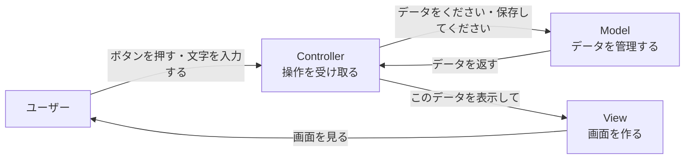
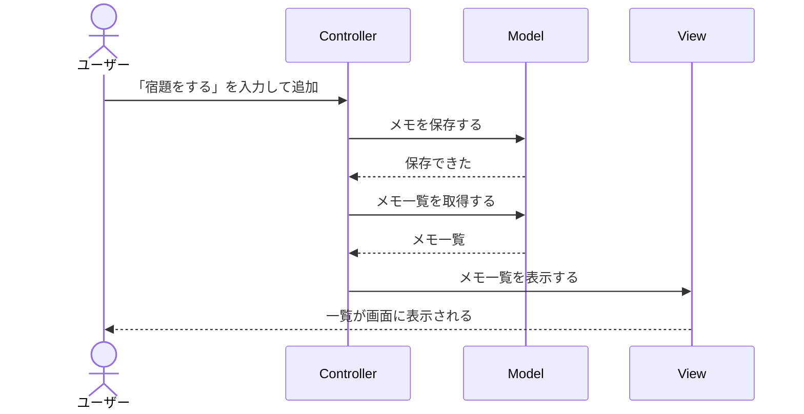

# MVC勉強用基礎資料

## 1. MVCとは

MVC（エム・ブイ・シー）は、アプリの作り方を整理するための考え方です。

アプリの中身を、次の3つの担当に分けます。

| 名前 | 役割 | たとえるなら |
| --- | --- | --- |
| **Model（モデル）** | データを保存したり、計算したりする | 台所・食材を管理する人 |
| **View（ビュー）** | 画面を表示する | 料理を盛り付けて出す人 |
| **Controller（コントローラー）** | ユーザーの操作を受け取り、ModelとViewをつなぐ | 注文を聞いて台所に伝える店員 |

MVCの一番大切な考え方は、**1つの担当に仕事をさせすぎない**ことです。

## 2. 身近なたとえ：レストラン

レストランでお客さんが「カレーをください」と注文した場合を考えます。

1. お客さんが注文する
2. 店員が注文を聞く
3. 店員が台所にカレーを作るように伝える
4. 台所がカレーを作る
5. 店員がカレーを受け取る
6. お客さんにカレーを見せる

アプリでも、だいたい同じ流れになります。



## 3. 3つの担当をもう少し詳しく

### Model（モデル）

Modelは、アプリで使うデータと、そのデータを扱うルールを担当します。

例えば、メモアプリなら次のような仕事をします。

- メモを保存する
- 保存されているメモを読み出す
- メモを削除する
- 空のメモを保存しないように確認する

Modelは、「文字をどのような見た目で表示するか」は考えません。

### View（ビュー）

Viewは、ユーザーに見える画面を担当します。

例えば、次のようなものです。

- メモの一覧を表示する
- 入力欄を表示する
- 「保存しました」というメッセージを表示する

Viewは、「データをどこに保存するか」は考えません。

### Controller（コントローラー）

Controllerは、ユーザーの操作を受け取り、ModelとViewに仕事を頼みます。

例えば、メモアプリで「追加」ボタンが押されたら、次のように動きます。

1. 入力されたメモを受け取る
2. Modelに「このメモを保存して」と頼む
3. Modelから最新のメモ一覧を受け取る
4. Viewに「この一覧を画面に表示して」と頼む

## 4. 簡単な構成例：メモ一覧アプリ

ここでは、メモを追加して一覧で見るだけの小さなアプリを考えます。

### フォルダー構成

```text
memo-app/
├─ models/
│  └─ memoModel.js
├─ views/
│  └─ memoView.js
├─ controllers/
│  └─ memoController.js
└─ app.js
```

ファイルを担当ごとに分けると、どこに何を書くかが分かりやすくなります。

### Modelの例

```javascript
// models/memoModel.js
const memos = [];

function addMemo(text) {
  if (text.trim() === "") {
    return false;
  }

  memos.push(text);
  return true;
}

function getMemos() {
  return memos;
}

module.exports = {
  addMemo,
  getMemos
};
```

このModelは、メモを配列に保存しています。

実際の大きなアプリでは、配列の代わりにデータベースへ保存することもあります。
しかし、**データを保存する担当がModelである**という考え方は同じです。

### Viewの例

```javascript
// views/memoView.js
function showMemos(memos) {
  console.log("メモ一覧");

  memos.forEach((memo, index) => {
    console.log(`${index + 1}: ${memo}`);
  });
}

function showMessage(message) {
  console.log(message);
}

module.exports = {
  showMemos,
  showMessage
};
```

この例では画面の代わりに、コンソールへ文字を表示しています。
Webアプリなら、HTMLを作ってブラウザーに表示する部分がViewになります。

### Controllerの例

```javascript
// controllers/memoController.js
const memoModel = require("../models/memoModel");
const memoView = require("../views/memoView");

function addMemo(text) {
  const saved = memoModel.addMemo(text);

  if (saved) {
    memoView.showMessage("メモを保存しました");
  } else {
    memoView.showMessage("メモを入力してください");
  }

  showMemos();
}

function showMemos() {
  const memos = memoModel.getMemos();
  memoView.showMemos(memos);
}

module.exports = {
  addMemo,
  showMemos
};
```

Controllerは、ModelとViewを直接つなぐ案内役です。

### アプリを動かす例

```javascript
// app.js
const memoController = require("./controllers/memoController");

memoController.addMemo("宿題をする");
memoController.addMemo("本を読む");
```

この処理の結果は、次のようになります。

```text
メモを保存しました
メモ一覧
1: 宿題をする

メモを保存しました
メモ一覧
1: 宿題をする
2: 本を読む
```

## 5. 1回の操作で起きること

「宿題をする」というメモを追加する場合は、次の順番で処理されます。



## 6. MVCにするとうれしいこと

### 変更しやすい

画面のデザインを変更しても、データの保存方法まで変更しなくてよい場合があります。

例えば、コンソール表示をWeb画面に変更するとき、Modelはそのまま使えます。

### 間違いを見つけやすい

「メモが保存されない」ならModelを確認します。

「保存されたのに画面に出ない」ならViewやControllerを確認します。

担当が分かれているので、問題の場所を探しやすくなります。

### 複数人で作業しやすい

ある人がModelを作り、別の人がViewを作るという分担ができます。

## 7. 注意すること

MVCは、ファイルを3つに分ければ完成というルールではありません。

大切なのは、次のように役割を混ぜすぎないことです。

- Modelに画面表示の処理を書かない
- Viewにデータ保存の処理を書かない
- Controllerにすべての計算やデータ管理を書きすぎない

小さなプログラムでは、無理にたくさんのファイルへ分ける必要はありません。
アプリが大きくなってきたときに、役割ごとに整理すると効果を発揮します。

## 8. まとめ

MVCは、アプリを次の3つの担当に分ける考え方です。

```text
Model      = データを管理する
View       = 画面を表示する
Controller = 操作を受け取り、ModelとViewをつなぐ
```

まずは「データ」「画面」「つなぐ役割」を分けて考えることから始めましょう。
この考え方が分かると、Webアプリやスマートフォンアプリの構成も理解しやすくなります。
