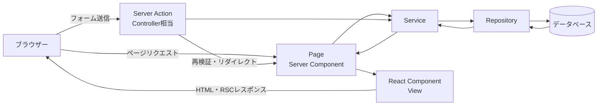
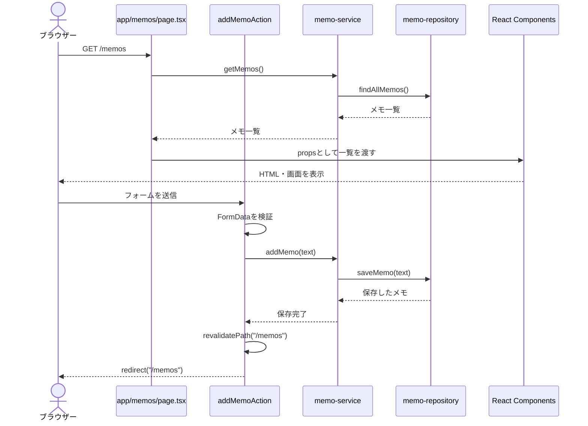

# Next.js構成MVC解説

## 1. この資料で説明すること

MVCそのものの考え方は、[MVC勉強用基礎資料](./MVC勉強用基礎資料.md)で説明しています。

この資料では、**Next.jsでWebアプリを作るときに、MVCの役割がどのファイルや処理になるのか**を説明します。

例として、メモを一覧表示し、追加できるアプリを考えます。

この資料では、Next.jsの現在よく使われる**App Router**とTypeScriptを前提にします。

## 2. Next.jsとReactの関係

### React

Reactは、ユーザーインターフェースを部品（コンポーネント）に分けて作るためのライブラリです。

- JSXで画面の構造を書く
- コンポーネントを組み合わせて画面を作る
- stateやイベントで画面を更新する

### Next.js

Next.jsは、Reactを使ったWebアプリケーションを作るためのフレームワークです。

- URLとファイルを対応させる
- サーバーでReactを実行する
- ページをサーバーで生成する
- Route HandlerでAPIを作る
- Server Actionsでサーバー処理を呼び出す
- 画像、フォント、ビルドなどを扱う

つまり、関係は次のようになります。

```text
React    = 画面をコンポーネントで作るためのライブラリ
Next.js  = Reactを使ってWebアプリ全体を構成するフレームワーク
```

Next.jsはMVCという名前のフォルダー構成を強制しません。
そのため、MVCとして整理する場合は、Next.jsの機能をそれぞれの責務に対応させて考えます。

## 3. Next.js MVCの全体像

Next.jsでデータベースを使う画面を表示する場合、基本的には次のような構成になります。



Next.jsでは、Spring MVCのようなControllerクラスが必ず存在するわけではありません。
ページを表示する処理は`page.tsx`、フォーム送信はServer Action、JSON APIはRoute Handlerに分けることが多くなります。

```text
Page・Server Action・Route Handler = リクエストを受け、処理を呼び出す入口
Service                         = アプリケーションの処理やルール
Repository                      = データベースとのやり取り
Model                           = データの形や状態
React Component                 = 画面の表示
```

### MVCとNext.jsの対応関係

| MVC | Next.jsで対応するもの | 主な場所 | 担当すること |
| --- | --- | --- | --- |
| **Model** | 型・Entity、Service、Repository | `src/lib/`、`src/models/` | データを表す、ルールを実行する、データを保存・取得する |
| **View** | React Server Component・Client Component | `app/`、`src/components/` | データを画面として表示する |
| **Controller** | Page、Server Action、Route Handler | `app/**/page.tsx`、`src/actions/`、`app/**/route.ts` | リクエストを受け、処理を呼び出し、画面やJSONを返す |

厳密には、PageやServer ActionはNext.jsの機能名であり、MVCのControllerそのものではありません。
しかし、**入力を受け取り、Serviceを呼び出し、結果を次へ渡す入口**という役割を持つため、Controller相当として整理できます。

## 4. フォルダー構成の例

```text
memo-app/
├─ app/
│  ├─ layout.tsx
│  ├─ page.tsx
│  ├─ memos/
│  │  ├─ page.tsx
│  │  └─ actions.ts
│  └─ api/
│     └─ memos/
│        └─ route.ts
├─ src/
│  ├─ components/
│  │  ├─ MemoForm.tsx
│  │  └─ MemoList.tsx
│  ├─ lib/
│  │  ├─ memo-service.ts
│  │  └─ memo-repository.ts
│  └─ models/
│     └─ memo.ts
├─ public/
├─ package.json
└─ tsconfig.json
```

Next.jsでは、`app`フォルダー内にURLに対応するページを置きます。

```text
app/memos/page.tsx     = /memos
app/api/memos/route.ts = /api/memos
```

`src/components`には画面部品、`src/lib`にはServiceやRepositoryなどの処理を置く構成にしています。
プロジェクトによっては、機能ごとに`features/memos/`へまとめる構成もあります。

## 5. Model側の型

### 5.1 メモのデータを表す型

```typescript
// src/models/memo.ts
export type Memo = {
  id: number;
  text: string;
};
```

この型は、メモ1件分のデータの形を表します。

画面のHTMLを作る処理や、フォームの送信を受け取る処理は書きません。

TypeScriptの`type`や`interface`は、主に開発中の型チェックに使われます。
実行時に入力値を検証するためには、別途バリデーション処理が必要です。

### 5.2 Repository

まずはデータベースを使わず、メモリ上の配列に保存する例にします。

```typescript
// src/lib/memo-repository.ts
import type { Memo } from "@/src/models/memo";

const memos: Memo[] = [];
let nextId = 1;

export async function findAllMemos(): Promise<Memo[]> {
  return [...memos];
}

export async function saveMemo(text: string): Promise<Memo> {
  const memo = { id: nextId++, text };
  memos.push(memo);
  return memo;
}
```

Repositoryは、データの保存や取得を担当します。

実際のアプリでは、配列の代わりにPrisma、Drizzle、SQL、MongoDBなどを使ってデータベースへアクセスします。
データベースへの処理をRepositoryに集めておけば、PageやServer Actionから見た役割は変わりません。

なお、サーバーレス環境では、モジュール内の配列が永続的な保存先になるとは限りません。
実際のデータを保持する場合は、データベースなどの永続ストレージを使います。

### 5.3 Service

```typescript
// src/lib/memo-service.ts
import type { Memo } from "@/src/models/memo";
import {
  findAllMemos,
  saveMemo,
} from "@/src/lib/memo-repository";

export async function getMemos(): Promise<Memo[]> {
  return findAllMemos();
}

export async function addMemo(text: string): Promise<Memo> {
  const normalizedText = text.trim();

  if (normalizedText === "") {
    throw new Error("メモを入力してください");
  }

  return saveMemo(normalizedText);
}
```

Serviceは、アプリケーションの処理や業務ルールを担当します。

この例では、「空のメモは保存しない」「前後の空白を取り除く」というルールをServiceに置いています。
PageやServer Actionにルールを書きすぎると、画面やAPIが増えたときに処理が重複しやすくなります。

## 6. View（Reactコンポーネント）

### 6.1 メモ一覧のコンポーネント

```tsx
// src/components/MemoList.tsx
import type { Memo } from "@/src/models/memo";

type MemoListProps = {
  memos: Memo[];
};

export function MemoList({ memos }: MemoListProps) {
  return (
    <ul>
      {memos.map((memo) => (
        <li key={memo.id}>{memo.text}</li>
      ))}
    </ul>
  );
}
```

`MemoList`は、受け取ったメモ一覧を画面に表示するだけのViewです。

データベースへアクセスしたり、保存ルールを判断したりしません。
表示に必要なデータは、親のPageやServiceから受け取ります。

### 6.2 メモ入力フォーム

フォームをServer Actionへ送信するだけなら、Client Componentにする必要はありません。

```tsx
// src/components/MemoForm.tsx
import type { FormHTMLAttributes } from "react";

type MemoFormProps = {
  action: FormHTMLAttributes<HTMLFormElement>["action"];
};

export function MemoForm({ action }: MemoFormProps) {
  return (
    <form action={action}>
      <label>
        メモ
        <input type="text" name="text" />
      </label>
      <button type="submit">追加</button>
    </form>
  );
}
```

`useState`やクリックイベントなど、ブラウザー側の機能が必要な場合は、ファイルの先頭に`"use client"`を書いてClient Componentにします。

```tsx
"use client";

import { useState } from "react";

export function CharacterCountInput() {
  const [text, setText] = useState("");

  return (
    <>
      <input value={text} onChange={(event) => setText(event.target.value)} />
      <p>{text.length}文字</p>
    </>
  );
}
```

Client Componentでも、データベースへ直接接続する処理は書きません。
ブラウザーへ送信されるコードに、データベースの認証情報を含めないためです。

## 7. Page（画面表示の入口）

`app/memos/page.tsx`は、`/memos`に対応するページです。
App RouterのPageは、デフォルトではServer Componentとして動作します。

```tsx
// app/memos/page.tsx
import { MemoForm } from "@/src/components/MemoForm";
import { MemoList } from "@/src/components/MemoList";
import { addMemoAction } from "./actions";
import { getMemos } from "@/src/lib/memo-service";

export default async function MemosPage() {
  const memos = await getMemos();

  return (
    <main>
      <h1>メモ一覧</h1>
      <MemoForm action={addMemoAction} />
      <MemoList memos={memos} />
    </main>
  );
}
```

Pageの主な役割は次のとおりです。

- URLに対応する画面を定義する
- Serviceから表示用のデータを取得する
- Viewコンポーネントへデータを渡す
- ページ全体の構造を組み立てる

Pageにデータベース処理や複雑な業務ルールを直接書くのではなく、Serviceへ分けます。

## 8. Server Action（フォーム送信の入口）

Server Actionは、ブラウザーからサーバー上の関数を呼び出すための仕組みです。
フォームの送信処理などでは、Controllerに近い役割を持ちます。

```typescript
// app/memos/actions.ts
"use server";

import { revalidatePath } from "next/cache";
import { redirect } from "next/navigation";
import { addMemo } from "@/src/lib/memo-service";

export async function addMemoAction(formData: FormData) {
  const text = formData.get("text");

  if (typeof text !== "string") {
    throw new Error("メモの入力値が不正です");
  }

  await addMemo(text);

  revalidatePath("/memos");
  redirect("/memos");
}
```

`"use server"`は、この関数をサーバー側で実行することを示します。
Server Actionでは、入力値を信頼せず、型や内容を検証してからServiceへ渡します。

### Server Actionで使っている処理

| 処理 | 役割 |
| --- | --- |
| `formData.get("text")` | フォームから入力値を受け取る |
| `typeof text !== "string"` | 期待する型か確認する |
| `revalidatePath("/memos")` | キャッシュされたページを再検証する |
| `redirect("/memos")` | 処理後にメモ一覧へ移動する |

`revalidatePath`を呼ぶことで、保存後に一覧を最新の状態へ更新できます。
保存後にリダイレクトする流れは、Spring MVCで説明したPost/Redirect/Get（PRG）に似ています。

実際のアプリでは、エラーを画面へ表示するために`useActionState`などを使い、例外をユーザー向けの状態へ変換することもあります。

## 9. Route Handler（JSON APIの入口）

画面ではなくJSONを返すAPIを作る場合は、`route.ts`を使います。

```typescript
// app/api/memos/route.ts
import { NextResponse } from "next/server";
import { addMemo, getMemos } from "@/src/lib/memo-service";

export async function GET() {
  const memos = await getMemos();
  return NextResponse.json(memos);
}

export async function POST(request: Request) {
  const body: unknown = await request.json();

  if (
    typeof body !== "object" ||
    body === null ||
    !("text" in body) ||
    typeof body.text !== "string"
  ) {
    return NextResponse.json(
      { message: "メモの入力値が不正です" },
      { status: 400 },
    );
  }

  const memo = await addMemo(body.text);
  return NextResponse.json(memo, { status: 201 });
}
```

Route Handlerは、HTTPメソッドに対応する関数を公開します。

| 関数 | HTTPメソッド | 役割 |
| --- | --- | --- |
| `GET` | GET | メモ一覧を返す |
| `POST` | POST | メモを保存する |

画面を返すPageと、JSONを返すRoute Handlerは入口が違います。
ただし、どちらもServiceを呼び出し、データ処理を入口の処理に集中させないという考え方は同じです。

## 10. 1回の操作で起きること

ブラウザーで`/memos`を開き、メモを追加する場合の流れは次のとおりです。



JSON APIを利用する場合は、PageやServer Actionの代わりにRoute Handlerが入口になります。

```text
ブラウザー・別サービス
  ↓
Route Handler
  ↓
Service
  ↓
Repository
  ↓
データベース
```

## 11. Server ComponentとClient Component

Next.jsのMVCを理解するには、Server ComponentとClient Componentの違いも重要です。

### Server Component

Server Componentはサーバー上で実行されます。

- サーバー側でServiceやRepositoryを呼び出せる
- データベースからデータを取得しやすい
- ブラウザーへ送るJavaScriptを減らせる
- `useState`や`onClick`などのブラウザー側の状態管理は使えない

PageはデフォルトでServer Componentです。

### Client Component

Client Componentは、ファイルの先頭に`"use client"`を書いて宣言します。

- `useState`や`useEffect`を使える
- `onClick`や`onChange`などのイベントを扱える
- ブラウザー上でインタラクティブな処理を実行できる
- その分、ブラウザーへJavaScriptを送る必要がある

```text
データ取得・画面の組み立て       : Server Component
入力状態・クリック・アニメーション : Client Component
```

Client Componentからデータを変更するときは、Server ActionやRoute Handlerを呼び出します。
RepositoryをClient Componentから直接importする構成にはしません。

## 12. 役割ごとの責任範囲

| 層 | 担当すること | 担当しないこと |
| --- | --- | --- |
| Page | URLに対応する画面を組み立て、データをViewへ渡す | 複雑な業務ルール、SQL |
| Server Action | フォーム入力を受け、Serviceを呼び出し、画面を再検証する | 画面全体のHTML、直接のDB処理 |
| Route Handler | HTTPリクエストを受け、JSONなどのレスポンスを返す | 複雑な業務ルール、直接のDB処理 |
| Service | 業務ルール、複数処理の組み合わせ | JSX、HTTPレスポンス |
| Repository | データの保存、検索、更新、削除 | 画面遷移、ユーザー向けメッセージ |
| Model・型 | データの状態やデータ構造を表す | リクエストの振り分け |
| React Component | HTMLや入力フォームを表示する | データベースへの直接アクセス |

小さなアプリでは、ServiceやRepositoryを省略してPageやRoute Handlerからデータ処理を呼び出すこともあります。
ただし、同じ処理を複数の画面やAPIから使うようになったら、ServiceやRepositoryへ分けることを検討します。

## 13. よくある混同と注意点

### MVCのフォルダー構成が必須ではない

Next.jsには、`models`、`views`、`controllers`というフォルダーを必ず作るルールはありません。

重要なのはフォルダー名ではなく、次のように責務を分けることです。

```text
画面表示       = React Component
入力・HTTP受付  = Page、Server Action、Route Handler
業務ルール     = Service
データアクセス  = Repository
```

### Pageにすべてを書かない

Pageに次の処理をすべて書くと、画面が複雑になります。

- フォーム入力の細かな検証
- 複数のデータ取得
- 業務ルールの判定
- データベースへの直接アクセス

Pageは画面の組み立てに集中させ、処理はServiceやRepositoryへ分けます。

### Client Componentから秘密情報を扱わない

`"use client"`を付けたファイルや、そのファイルから参照される処理は、ブラウザーへ送られる可能性があります。

- データベースのパスワード
- サーバー専用のAPIキー
- データベースクライアント

このような情報をClient Componentへ持ち込んではいけません。
サーバー専用の処理はServer Component、Server Action、Route Handler、Service側に置きます。

### 入力値をそのまま信頼しない

TypeScriptの型は、ブラウザーから送信された実データを検証してくれるわけではありません。
Server ActionやRoute Handlerでは、`FormData`やJSONの値を実行時にも確認します。

入力が複雑になった場合は、Zodなどのバリデーションライブラリを使う方法もあります。

### キャッシュと再検証を意識する

Next.jsでは、取得したデータやページがキャッシュされることがあります。
データを更新した後に一覧が古いままの場合は、`revalidatePath`や`revalidateTag`などを使って再検証します。

「保存処理は成功したのに画面が更新されない」という問題は、MVCの責務分担だけでなく、Next.jsのキャッシュ設定も確認します。

### Modelと画面用データを混ぜすぎない

データベースのEntityを、そのまま画面やAPIのレスポンスに使うと、不要な項目まで公開することがあります。

アプリが大きくなったら、次のような型を分けることを検討します。

```text
MemoEntity       = データベースのデータ
CreateMemoInput  = メモ作成時の入力
MemoResponse     = APIや画面へ返すデータ
```

## 14. 画面表示とAPIの使い分け

| 目的 | Next.jsの機能 | 主な返り値 |
| --- | --- | --- |
| サーバーでページを表示する | `page.tsx` | Reactの画面 |
| フォームからサーバー処理を呼ぶ | Server Action | 状態更新、リダイレクト |
| 外部サービスや別アプリから利用するAPIを作る | Route Handler | JSON、HTTPレスポンス |
| ブラウザー内だけで表示を変える | Client Component | Reactの再描画 |

例えば、Next.jsの画面内にある登録フォームならServer Actionが使いやすいです。
モバイルアプリや別のフロントエンドからも利用するAPIなら、Route Handlerを選びます。

どの入口を選んでも、次のように共通のServiceを呼ぶ構成にすると、処理の重複を減らせます。

```text
Server Action ─┐
               ├─> MemoService ─> MemoRepository
Route Handler ─┘
```

## 15. まとめ

Next.jsでMVCを構成すると、処理の流れは次のようになります。

```text
画面表示:
ブラウザー
  ↓
Page（Server Component）
  ↓
Service
  ↓
Repository
  ↓
データベース
```

フォーム送信では、次のようになります。

```text
フォーム
  ↓
Server Action
  ↓
Service
  ↓
Repository
  ↓
再検証・リダイレクト
```

役割をまとめると、次のとおりです。

```text
Page・Server Action・Route Handler = リクエストの受付と処理の呼び出し
Service                         = アプリケーションのルールと処理
Repository                      = データの保存と取得
Model                          = データの型や状態
React Component                 = HTML画面や入力部品
```

Next.jsではMVCの名前やフォルダー構成が強制されないため、最初は`Page → Service → Repository`の流れを追えるようにします。
慣れてきたら、Server ComponentとClient Component、Server Action、Route Handler、入力検証、DTO、キャッシュ再検証などを追加していくと、Next.jsのMVC構成を理解しやすくなります。
