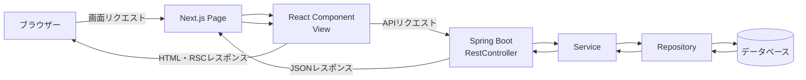
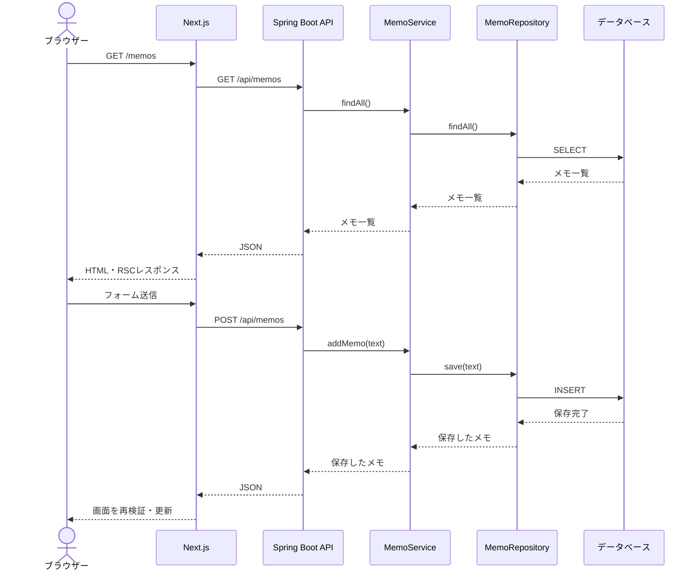

# Spring BootとNext.js併用構成MVC解説

## 1. この資料で説明すること

MVCそのものの考え方は、[MVC勉強用基礎資料](./MVC勉強用基礎資料.md)で説明しています。

また、Spring Boot単体の構成は[Spring Boot構成MVC解説](./SpringBoot構成MVC解説.md)、
Next.js単体の構成は[Next.js構成MVC解説](./NextJs構成MVC解説.md)で説明しています。

この資料では、**Spring Bootをバックエンド、Next.jsをフロントエンドとして併用するときに、MVCの役割がどこへ分かれるのか**を説明します。

例として、メモを一覧表示し、追加できるアプリを考えます。

この資料では、次の構成を前提にします。

- Spring Boot：REST API、業務ルール、データベースアクセス
- Next.js：画面表示、ユーザー操作、Spring Boot APIの呼び出し
- Next.jsはApp RouterとTypeScriptを使用する
- Spring Bootは`@RestController`でJSONを返す

## 2. Spring BootとNext.jsの役割

Spring BootとNext.jsは、1つのアプリを2つのアプリケーションに分けて担当します。

```text
Spring Boot = 業務処理とデータを扱うバックエンド
Next.js     = 画面を表示し、ユーザー操作を受け付けるフロントエンド
```

### Spring Boot側

Spring Bootは、ブラウザーから直接画面を受け取るのではなく、Next.jsから呼び出されるAPIを提供します。

- HTTPリクエストを受け取る
- 入力値を検証する
- Serviceで業務ルールを実行する
- Repositoryを通してデータベースへアクセスする
- JSONレスポンスを返す

### Next.js側

Next.jsは、Spring Boot APIから受け取ったデータを画面に表示します。

- URLに対応するページを表示する
- Reactコンポーネントで画面を作る
- フォーム入力やボタン操作を受け取る
- Spring Boot APIを呼び出す
- APIの結果に応じて画面を更新する

Next.jsにもPageやServer Actionなどの「リクエストの入口」はありますが、この構成では主に**Spring Boot APIを利用するためのフロントエンド側の入口**として扱います。

## 3. 併用構成の全体像



この構成では、MVCの役割が1つのプロジェクト内にすべて存在するわけではありません。

```text
Spring Boot側
  Model      = Entity、DTO、Service、Repository
  Controller = @RestController
  View       = 原則として持たない（JSONを返す）

Next.js側
  Model      = APIレスポンスの型、画面用のデータ
  Controller = Page、Server Action、イベント処理などの入口
  View       = React Server Component・Client Component
```

Spring BootのControllerとNext.jsのPageを、同じControllerとして扱うわけではありません。
Spring BootのControllerは**APIの入口**、Next.jsのPageやフォーム処理は**画面の入口**です。

## 4. MVCと各アプリの対応関係

| MVC | Spring Bootで対応するもの | Next.jsで対応するもの | 担当すること |
| --- | --- | --- | --- |
| **Model** | Entity、DTO、Service、Repository | APIレスポンスの型、画面用の型、APIクライアント | データを表す、ルールを実行する、APIとデータをやり取りする |
| **View** | 原則なし | React Server Component・Client Component | データを画面として表示する |
| **Controller** | `@RestController` | Page、Server Action、フォームイベント処理 | リクエストやユーザー操作を受け、処理を呼び出す |

重要なのは、**業務ルールの本体をSpring Boot側に置く**ことです。

Next.js側で入力チェックを行うことはできますが、それはユーザー体験をよくするための補助的なチェックです。
APIはブラウザー以外からも呼び出せるため、Spring Boot側でも必ず入力値を検証し、業務ルールを適用します。

## 5. フォルダー構成の例

```text
memo-app/
├─ backend/
│  ├─ src/
│  │  ├─ main/
│  │  │  ├─ java/com/example/memo/
│  │  │  │  ├─ MemoApplication.java
│  │  │  │  ├─ controller/
│  │  │  │  │  └─ MemoController.java
│  │  │  │  ├─ service/
│  │  │  │  │  └─ MemoService.java
│  │  │  │  ├─ repository/
│  │  │  │  │  └─ MemoRepository.java
│  │  │  │  └─ model/
│  │  │  │     ├─ Memo.java
│  │  │  │     └─ MemoResponse.java
│  │  │  └─ resources/
│  │  │     └─ application.properties
│  │  └─ test/
│  └─ pom.xml
│
├─ frontend/
│  ├─ app/
│  │  └─ memos/
│  │     └─ page.tsx
│  ├─ src/
│  │  ├─ components/
│  │  │  ├─ MemoForm.tsx
│  │  │  └─ MemoList.tsx
│  │  ├─ lib/
│  │  │  └─ memo-api.ts
│  │  └─ models/
│  │     └─ memo.ts
│  ├─ package.json
│  └─ tsconfig.json
│
└─ README.md
```

`backend`と`frontend`を別のリポジトリに分けることもできます。
同じリポジトリに置く場合でも、依存関係、起動方法、テストはそれぞれ独立しています。

## 6. Spring Boot側のAPI

### 6.1 ModelとレスポンスDTO

```java
package com.example.memo.model;

public record MemoResponse(long id, String text) {
}
```

APIのレスポンスには、データベースのEntityをそのまま返さず、レスポンス用DTOを使う構成がよくあります。
DTOを分けると、内部の項目を意図せず公開したり、データベースの変更がAPIの形式に直接影響したりすることを防ぎやすくなります。

### 6.2 Service

```java
package com.example.memo.service;

import com.example.memo.model.Memo;
import com.example.memo.repository.MemoRepository;
import org.springframework.stereotype.Service;

import java.util.List;

@Service
public class MemoService {

    private final MemoRepository memoRepository;

    public MemoService(MemoRepository memoRepository) {
        this.memoRepository = memoRepository;
    }

    public List<Memo> findAll() {
        return memoRepository.findAll();
    }

    public Memo addMemo(String text) {
        if (text == null || text.trim().isEmpty()) {
            throw new IllegalArgumentException("メモを入力してください");
        }

        return memoRepository.save(text.trim());
    }
}
```

空のメモを保存しないというルールは、画面ではなくServiceに置きます。
Next.js以外のクライアントからAPIが呼び出された場合でも、同じルールを適用できます。

### 6.3 REST Controller

```java
package com.example.memo.controller;

import com.example.memo.model.Memo;
import com.example.memo.service.MemoService;
import org.springframework.web.bind.annotation.*;

import java.util.List;

@RestController
@RequestMapping("/api/memos")
public class MemoController {

    private final MemoService memoService;

    public MemoController(MemoService memoService) {
        this.memoService = memoService;
    }

    @GetMapping
    public List<Memo> getMemos() {
        return memoService.findAll();
    }

    @PostMapping
    public Memo addMemo(@RequestBody AddMemoRequest request) {
        return memoService.addMemo(request.text());
    }

    public record AddMemoRequest(String text) {
    }
}
```

`@RestController`は、戻り値をHTMLのView名ではなくJSONレスポンスとして返します。

```text
GET  /api/memos       = メモ一覧をJSONで取得
POST /api/memos       = リクエストボディのメモを登録
```

実際のアプリでは、入力検証用のアノテーション、例外ハンドラー、認証・認可なども追加します。

## 7. Next.js側のModelとAPIクライアント

### 7.1 APIレスポンスの型

```typescript
// frontend/src/models/memo.ts
export type Memo = {
  id: number;
  text: string;
};
```

この型は、Spring Boot APIが返すJSONの形をNext.js側で表します。
Javaの`MemoResponse`とTypeScriptの`Memo`は、同じAPI契約に対応する別の型です。

### 7.2 APIクライアント

```typescript
// frontend/src/lib/memo-api.ts
import type { Memo } from "@/src/models/memo";

const apiBaseUrl = process.env.SPRING_API_URL ?? "http://localhost:8080";

export async function fetchMemos(): Promise<Memo[]> {
  const response = await fetch(`${apiBaseUrl}/api/memos`, {
    cache: "no-store",
  });

  if (!response.ok) {
    throw new Error("メモ一覧の取得に失敗しました");
  }

  return response.json();
}

export async function createMemo(text: string): Promise<Memo> {
  const response = await fetch(`${apiBaseUrl}/api/memos`, {
    method: "POST",
    headers: {
      "Content-Type": "application/json",
    },
    body: JSON.stringify({ text }),
  });

  if (!response.ok) {
    throw new Error("メモの登録に失敗しました");
  }

  return response.json();
}
```

API呼び出しをPageやComponentに直接書かず、APIクライアントに集めると、URL、ヘッダー、エラー処理の変更を一か所で管理できます。

`SPRING_API_URL`はサーバー側からSpring Bootへ接続するときのURLです。
ブラウザーから直接APIを呼び出す構成では、ブラウザーから到達できるURLとCORS設定も必要になります。

## 8. Next.js側のViewとPage

```tsx
// frontend/app/memos/page.tsx
import { fetchMemos } from "@/src/lib/memo-api";
import { MemoForm } from "@/src/components/MemoForm";
import { MemoList } from "@/src/components/MemoList";

export default async function MemosPage() {
  const memos = await fetchMemos();

  return (
    <main>
      <h1>メモ一覧</h1>
      <MemoForm />
      <MemoList memos={memos} />
    </main>
  );
}
```

Pageは画面表示の入口です。
Spring Boot APIからデータを取得し、そのデータをReactコンポーネントへ渡します。

```tsx
// frontend/src/components/MemoList.tsx
import type { Memo } from "@/src/models/memo";

type MemoListProps = {
  memos: Memo[];
};

export function MemoList({ memos }: MemoListProps) {
  return (
    <ul>
      {memos.map((memo) => (
        <li key={memo.id}>{memo.text}</li>
      ))}
    </ul>
  );
}
```

Reactコンポーネントは、データをHTMLとして表示します。
データベースへ直接アクセスしたり、Spring BootのServiceを呼び出したりはしません。

## 9. メモ追加の実装方法

Spring BootとNext.jsを併用する場合、フォーム送信には複数の方法があります。

### 方法1：Client ComponentからSpring Boot APIを呼び出す

```tsx
"use client";

import { useState } from "react";
import { createMemo } from "@/src/lib/memo-api";

export function MemoForm() {
  const [text, setText] = useState("");

  async function handleSubmit(event: React.FormEvent<HTMLFormElement>) {
    event.preventDefault();
    await createMemo(text);
    setText("");
    window.location.reload();
  }

  return (
    <form onSubmit={handleSubmit}>
      <input
        value={text}
        onChange={(event) => setText(event.target.value)}
        name="text"
      />
      <button type="submit">追加</button>
    </form>
  );
}
```

この方法では、ブラウザーがSpring Boot APIを直接呼び出します。
そのため、異なるポートやドメインで動かす開発環境では、Spring Boot側でCORSを設定する必要があります。

### 方法2：Next.jsのServer Actionを中継する

```tsx
// frontend/app/memos/actions.ts
"use server";

import { revalidatePath } from "next/cache";
import { createMemo } from "@/src/lib/memo-api";

export async function addMemoAction(formData: FormData) {
  const text = String(formData.get("text") ?? "");
  await createMemo(text);
  revalidatePath("/memos");
}
```

この方法では、ブラウザーはNext.jsへフォームを送信し、Next.jsのServer ActionがSpring Boot APIを呼び出します。
Spring BootのURLやアクセストークンをブラウザーへ公開したくない場合に使いやすい構成です。

どちらを採用しても、最終的な保存処理と業務ルールはSpring Boot側に置きます。

## 10. 1回の操作で起きること

ブラウザーで`/memos`を開き、メモを追加する場合の流れは次のとおりです。



Spring Bootの処理とNext.jsの処理は、HTTPとJSONを境界にして分離されています。
この境界があるため、将来モバイルアプリや別のフロントエンドから同じAPIを利用できます。

## 11. API通信の設計

### URLの分け方

APIであることが分かるように、`/api`を付ける構成が一般的です。

```text
画面URL       : http://localhost:3000/memos
Spring Boot API: http://localhost:8080/api/memos
```

### CORS

開発中にブラウザーから`localhost:3000`のNext.jsが`localhost:8080`のSpring Bootへアクセスすると、オリジンが異なります。
ブラウザーから直接呼び出す場合は、Spring Boot側でNext.jsのオリジンを許可します。

```java
@Configuration
public class CorsConfig implements WebMvcConfigurer {

    @Override
    public void addCorsMappings(CorsRegistry registry) {
        registry.addMapping("/api/**")
                .allowedOrigins("http://localhost:3000")
                .allowedMethods("GET", "POST", "PUT", "DELETE");
    }
}
```

許可するオリジンを`*`にすると、認証情報を伴う通信と組み合わせられない場合があります。
本番では、実際に利用するフロントエンドのオリジンだけを許可します。

### リバースプロキシ

本番では、Next.jsとSpring Bootを同一ドメイン配下に置き、リバースプロキシで振り分ける構成もあります。

```text
https://example.com/memos       -> Next.js
https://example.com/api/memos   -> Spring Boot
```

同一オリジンにできると、CORSの設定を減らせます。
ただし、リバースプロキシ、TLS、タイムアウト、ヘルスチェックなどのインフラ設定は別途必要です。

## 12. 認証と認可

認証を追加する場合、どのアプリが何を担当するかを先に決めます。

```text
Next.js     = ログイン画面、ログイン状態に応じた表示
Spring Boot = 認証情報の検証、ユーザーの権限確認、APIの保護
```

代表的な方法は次のとおりです。

| 方法 | 概要 | 注意点 |
| --- | --- | --- |
| HttpOnly Cookie | Spring BootがセッションやトークンをCookieで管理する | CSRF対策、SameSite、CORS設定が必要 |
| JWT | APIリクエストにアクセストークンを付ける | トークンの保管場所、期限、失効を設計する |
| Next.js中継 | ブラウザーはNext.jsだけと通信し、Next.jsがAPIを呼ぶ | Server側のCookie転送やセッション管理が必要 |

画面を表示できるかどうかだけをNext.jsで判定しても、API自体は保護されません。
Spring Bootの各APIで、認証と認可を必ず検証します。

## 13. 役割ごとの責任範囲

| 層 | 担当すること | 担当しないこと |
| --- | --- | --- |
| Next.js Page・Action | 画面リクエストやフォームを受け、APIを呼び出す | データベースへの直接アクセス、業務ルールの本体 |
| React Component | データを表示し、ユーザー操作を受け取る | Spring BootのRepository呼び出し |
| APIクライアント | URL、HTTPメソッド、JSON、通信エラーを扱う | 複雑な業務ルール |
| Spring Boot Controller | APIリクエストを受け、入力をServiceへ渡し、JSONを返す | HTML画面の作成、複雑な業務ルール |
| Spring Boot Service | 業務ルール、複数処理の組み合わせ、トランザクション | Reactの表示処理 |
| Spring Boot Repository | データの保存、検索、更新、削除 | 画面遷移、ユーザー向け表示 |
| データベース | データの永続化 | 画面表示、APIの振り分け |

## 14. よくある混同と注意点

### Next.jsとSpring Bootの両方に業務ルールを書かない

「空のメモは保存しない」のようなルールをNext.jsだけに書くと、別のクライアントからAPIを呼んだときに破られます。

Next.jsでは入力ミスを早く表示するためのチェックを行い、Spring Bootでは必須の検証と業務ルールを行います。

### EntityをそのままAPIレスポンスにしない

データベースのEntityを直接返すと、内部項目や関連データまで公開する危険があります。
APIの入力用DTO、出力用DTOを分けると、データベース設計と画面用の形式を独立させやすくなります。

### APIのレスポンス形式を暗黙に変更しない

Spring Boot側でJSONの項目名や型を変更すると、Next.js側が実行時に壊れることがあります。
API仕様をOpenAPIなどで管理したり、変更時に契約テストを実行したりする方法があります。

### Server ComponentとClient Componentを使い分ける

初期データの取得はServer Componentから行い、入力状態やクリックイベントが必要な部分だけClient Componentに分ける構成がよく使われます。
Client Componentに秘密情報やサーバー専用の認証情報を置いてはいけません。

### CORSを無制限に許可しない

開発中に動かすために`*`を設定したまま本番へ持ち込むのは避けます。
認証Cookieを使う場合は、許可オリジン、Cookie属性、CSRF対策を合わせて設計します。

### 二重送信やエラー表示を考慮する

ネットワーク通信は失敗する可能性があります。
登録ボタンの連打を防ぎ、ローディング中の表示、APIエラーの表示、タイムアウト時の扱いを設計します。

## 15. この構成のメリットと注意点

### メリット

- JavaやSpringの既存資産、複雑な業務処理を活用できる
- React/Next.jsでリッチな画面やSSRを実装できる
- APIをモバイルアプリや他のクライアントから再利用できる
- フロントエンドとバックエンドを独立してテスト・デプロイできる

### 注意点

- アプリが2つになるため、起動、ビルド、デプロイの管理が増える
- HTTP、JSON、CORS、認証などの境界を設計する必要がある
- APIの仕様変更でフロントエンドとバックエンドの互換性が壊れることがある
- 画面のエラーとAPIのエラーを適切に利用者へ伝える必要がある

単純な画面だけならNext.js単体やSpring Boot + Thymeleafのほうが構成を小さくできます。
既存のSpring Boot APIを利用したい場合、複数クライアントに同じ業務処理を提供したい場合、画面の表現力やSSRを重視する場合に、併用構成を検討します。

## 16. まとめ

Spring BootとNext.jsを併用すると、MVCは次のように分担されます。

```text
ブラウザー
  ↓
Next.js Page・React Component
  ↓ HTTP / JSON
Spring Boot @RestController
  ↓
Service
  ↓
Repository
  ↓
データベース
```

役割をまとめると、次のようになります。

```text
Next.js     = 画面表示、ユーザー操作、API呼び出し
Controller  = Spring Boot APIの受付とレスポンス
Service     = 業務ルールとアプリケーション処理
Repository  = データの保存と取得
Model       = Entity、DTO、APIレスポンスや画面データの形
View        = Next.jsのReactコンポーネント
```

最初は「Next.jsは画面」「Spring BootはAPIと業務処理」「データベースはSpring Bootからアクセス」という境界を意識すると、処理の流れを追いやすくなります。
慣れてきたら、DTO、認証、CORS、API仕様、エラー処理、キャッシュ、テストを追加していくと、実際のアプリに近い構成を理解できます。
