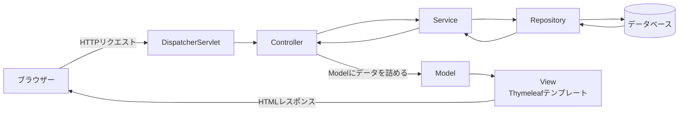
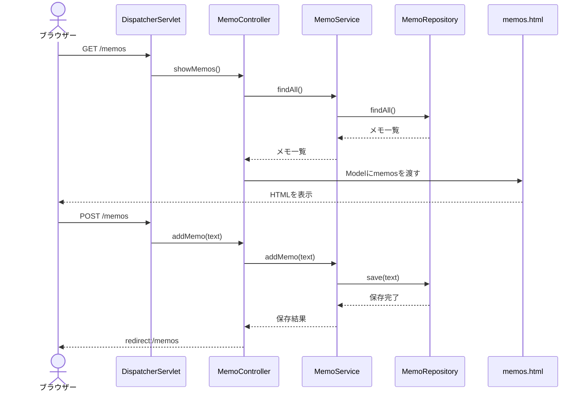

# Spring Boot構成MVC解説

## 1. この資料で説明すること

MVCそのものの考え方は、[MVC勉強用基礎資料](./MVC勉強用基礎資料.md)で説明しています。

この資料では、**Spring BootでWebアプリを作るときに、MVCの役割がどのクラスやファイルになるのか**を説明します。

例として、メモを一覧表示し、追加できるアプリを考えます。

## 2. Spring BootとSpring MVCの関係

### Spring Boot

Spring Bootは、Springを使ったアプリを作りやすくするための仕組みです。

- 初期設定を少なくできる
- 必要なライブラリをまとめて追加できる
- アプリケーションサーバーを組み込んで起動できる
- よく使う設定を自動で用意してくれる

### Spring MVC

Spring MVCは、SpringでWebアプリを作るためのフレームワークです。

HTTPリクエストを受け取り、適切なControllerを呼び出し、処理結果をViewに渡す役割を持ちます。

つまり、関係は次のようになります。

```text
Spring Boot = Springアプリを始めやすくする仕組み
Spring MVC  = WebアプリをMVCで構成する仕組み
```

## 3. Spring Boot MVCの全体像

Spring Bootで画面を表示する場合、基本的には次のような構成になります。



Spring MVCでは、ControllerがRepositoryを直接呼び出すのではなく、間にServiceを置く構成がよく使われます。

```text
Controller = リクエストを受け取り、画面遷移を決める
Service    = アプリケーションの処理やルールをまとめる
Repository = データベースとのやり取りを担当する
Model      = Viewへ渡すデータ
View       = HTML画面
```

厳密には、ServiceとRepositoryはMVCの3要素に直接含まれる名前ではありません。
しかし、Spring BootのアプリではModel側の処理を整理するために、ServiceやRepositoryを分けることが一般的です。

## 4. フォルダー構成の例

```text
memo-app/
├─ src/
│  ├─ main/
│  │  ├─ java/com/example/memo/
│  │  │  ├─ MemoApplication.java
│  │  │  ├─ controller/
│  │  │  │  └─ MemoController.java
│  │  │  ├─ service/
│  │  │  │  └─ MemoService.java
│  │  │  ├─ repository/
│  │  │  │  └─ MemoRepository.java
│  │  │  └─ model/
│  │  │     └─ Memo.java
│  │  │
│  │  └─ resources/
│  │     ├─ templates/
│  │     │  └─ memos.html
│  │     └─ application.properties
│  │
│  └─ test/
└─ pom.xml
```

`src/main/java`にはJavaのクラスを置き、`src/main/resources/templates`にはThymeleafのHTMLテンプレートを置きます。

パッケージ名は、実際のプロジェクトに合わせて変更してください。

## 5. アプリケーションの起動クラス

```java
package com.example.memo;

import org.springframework.boot.SpringApplication;
import org.springframework.boot.autoconfigure.SpringBootApplication;

@SpringBootApplication
public class MemoApplication {

    public static void main(String[] args) {
        SpringApplication.run(MemoApplication.class, args);
    }
}
```

`@SpringBootApplication`は、Spring Bootアプリケーションの開始地点を示します。

このクラスを実行すると、組み込みサーバーが起動し、通常は `http://localhost:8080` でアクセスできるようになります。

## 6. Model側のクラス

### 6.1 メモのデータを表すクラス

```java
package com.example.memo.model;

public class Memo {

    private final long id;
    private final String text;

    public Memo(long id, String text) {
        this.id = id;
        this.text = text;
    }

    public long getId() {
        return id;
    }

    public String getText() {
        return text;
    }
}
```

このクラスは、メモ1件分のデータを表します。

画面のHTMLを作る処理や、HTTPリクエストを受け取る処理は書きません。

### 6.2 Repository

まずはデータベースを使わず、メモリ上のリストに保存する例にします。

```java
package com.example.memo.repository;

import com.example.memo.model.Memo;
import org.springframework.stereotype.Repository;

import java.util.ArrayList;
import java.util.List;

@Repository
public class MemoRepository {

    private final List<Memo> memos = new ArrayList<>();
    private long nextId = 1;

    public List<Memo> findAll() {
        return List.copyOf(memos);
    }

    public void save(String text) {
        memos.add(new Memo(nextId++, text));
    }
}
```

`@Repository`は、データの保存や取得を担当するクラスであることを示します。

実際のアプリでは、リストの代わりにJPAやMyBatisなどを使ってデータベースへアクセスします。
保存先が変わっても、データアクセスの処理をRepositoryに集めておけば、Controllerから見た役割は変わりません。

### 6.3 Service

```java
package com.example.memo.service;

import com.example.memo.model.Memo;
import com.example.memo.repository.MemoRepository;
import org.springframework.stereotype.Service;

import java.util.List;

@Service
public class MemoService {

    private final MemoRepository memoRepository;

    public MemoService(MemoRepository memoRepository) {
        this.memoRepository = memoRepository;
    }

    public List<Memo> findAll() {
        return memoRepository.findAll();
    }

    public boolean addMemo(String text) {
        if (text == null || text.trim().isEmpty()) {
            return false;
        }

        memoRepository.save(text.trim());
        return true;
    }
}
```

`@Service`は、アプリケーションの処理や業務ルールを担当するクラスであることを示します。

この例では、「空のメモは保存しない」というルールをServiceに置いています。
Controllerにこのルールを書きすぎると、画面やAPIが増えたときに同じ処理が重複しやすくなります。

### 6.4 コンストラクタインジェクション

```java
public MemoService(MemoRepository memoRepository) {
    this.memoRepository = memoRepository;
}
```

このように、必要なクラスをコンストラクタで受け取る書き方を**コンストラクタインジェクション**と呼びます。

Springは `@Repository` や `@Service` が付いたクラスを管理し、必要な場所へ自動的に渡します。
クラス同士の依存関係が明確になり、テスト時に差し替えやすくなります。

## 7. Controller

```java
package com.example.memo.controller;

import com.example.memo.service.MemoService;
import org.springframework.stereotype.Controller;
import org.springframework.ui.Model;
import org.springframework.web.bind.annotation.GetMapping;
import org.springframework.web.bind.annotation.PostMapping;
import org.springframework.web.bind.annotation.RequestParam;
import org.springframework.web.servlet.mvc.support.RedirectAttributes;

@Controller
public class MemoController {

    private final MemoService memoService;

    public MemoController(MemoService memoService) {
        this.memoService = memoService;
    }

    @GetMapping("/memos")
    public String showMemos(Model model) {
        model.addAttribute("memos", memoService.findAll());
        return "memos";
    }

    @PostMapping("/memos")
    public String addMemo(
            @RequestParam("text") String text,
            RedirectAttributes redirectAttributes) {

        if (memoService.addMemo(text)) {
            redirectAttributes.addFlashAttribute("message", "メモを保存しました");
        } else {
            redirectAttributes.addFlashAttribute("message", "メモを入力してください");
        }

        return "redirect:/memos";
    }
}
```

### 主なアノテーション

| アノテーション | 役割 |
| --- | --- |
| `@Controller` | 画面表示を担当するControllerとして登録する |
| `@GetMapping` | GETリクエストとメソッドを結び付ける |
| `@PostMapping` | POSTリクエストとメソッドを結び付ける |
| `@RequestParam` | URLやフォームのパラメーターを受け取る |
| `Model` | ControllerからViewへデータを渡す |
| `RedirectAttributes` | リダイレクト先へ一時的なメッセージを渡す |

### `return "memos"` の意味

`return "memos";`は、`templates/memos.html`をViewとして表示するという意味です。

ファイル名に `.html`を付けず、テンプレート名だけを返します。

### `return "redirect:/memos"` の意味

`redirect:/memos`は、ブラウザーにもう一度 `/memos` へアクセスするよう指示します。

フォーム送信後にリダイレクトすることで、画面を更新したときに同じデータがもう一度登録される問題を防げます。
この考え方は**Post/Redirect/Get（PRG）**と呼ばれます。

## 8. View（Thymeleafテンプレート）

`src/main/resources/templates/memos.html`を作成します。

```html
<!DOCTYPE html>
<html lang="ja" xmlns:th="http://www.thymeleaf.org">
<head>
    <meta charset="UTF-8">
    <title>メモ一覧</title>
</head>
<body>
    <h1>メモ一覧</h1>

    <p th:if="${message}" th:text="${message}"></p>

    <form th:action="@{/memos}" method="post">
        <label>
            メモ
            <input type="text" name="text">
        </label>
        <button type="submit">追加</button>
    </form>

    <ul>
        <li th:each="memo : ${memos}" th:text="${memo.text}"></li>
    </ul>
</body>
</html>
```

### 主なThymeleafの記法

| 記法 | 役割 |
| --- | --- |
| `th:text` | 要素の文字をサーバー側の値で置き換える |
| `th:if` | 条件に合うときだけ要素を表示する |
| `th:each` | リストの要素を繰り返し表示する |
| `th:action` | フォームの送信先を指定する |
| `${memos}` | Modelに登録された `memos` の値を参照する |
| `@{/memos}` | アプリケーションのURLを組み立てる |

Controllerで次のように値を登録すると、

```java
model.addAttribute("memos", memoService.findAll());
```

Viewでは `${memos}` として参照できます。

## 9. 1回の操作で起きること

ブラウザーで `http://localhost:8080/memos` を開き、メモを追加する場合の流れは次のとおりです。



### DispatcherServletとは

`DispatcherServlet`は、Spring MVCの入口になる仕組みです。

すべてのリクエストを受け取り、URLとHTTPメソッドに合うControllerのメソッドへ処理を振り分けます。
通常はSpring Bootが設定してくれるため、自分でServletを作成する必要はありません。

## 10. 必要な依存関係の例

Mavenを使う場合、画面を表示する最小構成の主な依存関係は次のようになります。

```xml
<dependencies>
    <dependency>
        <groupId>org.springframework.boot</groupId>
        <artifactId>spring-boot-starter-web</artifactId>
    </dependency>

    <dependency>
        <groupId>org.springframework.boot</groupId>
        <artifactId>spring-boot-starter-thymeleaf</artifactId>
    </dependency>

    <dependency>
        <groupId>org.springframework.boot</groupId>
        <artifactId>spring-boot-starter-test</artifactId>
        <scope>test</scope>
    </dependency>
</dependencies>
```

`spring-boot-starter-web`はSpring MVCや組み込みサーバーなどを含みます。
`spring-boot-starter-thymeleaf`はThymeleafをViewとして使うための依存関係です。

Spring Bootのバージョンによって設定や推奨される書き方が変わることがあるため、実際にはプロジェクトで指定されたバージョンの公式ドキュメントも確認します。

## 11. REST APIの場合

HTML画面ではなくJSONを返す場合は、`@RestController`を使うことが多いです。

```java
@RestController
@RequestMapping("/api/memos")
public class MemoApiController {

    private final MemoService memoService;

    public MemoApiController(MemoService memoService) {
        this.memoService = memoService;
    }

    @GetMapping
    public List<Memo> getMemos() {
        return memoService.findAll();
    }
}
```

`@RestController`は、メソッドの戻り値をView名ではなく、レスポンスボディとして返します。
この場合、Viewの代わりにJSONを受け取るフロントエンドや他のサービスが利用します。

```text
画面を返す       : @Controller      + Thymeleaf
JSONを返すAPI    : @RestController  + JSON
```

どちらの場合も、ControllerからServiceを呼び出し、データ処理をControllerに集中させないという考え方は同じです。

## 12. 役割ごとの責任範囲

| 層 | 担当すること | 担当しないこと |
| --- | --- | --- |
| Controller | リクエストを受ける、入力を渡す、画面やレスポンスを返す | 複雑な業務ルール、SQL |
| Service | 業務ルール、複数処理の組み合わせ、トランザクションの単位 | HTMLの作成、HTTPの細かな処理 |
| Repository | データの保存、検索、更新、削除 | 画面遷移、ユーザー向けメッセージ |
| Model・Entity | データの状態やデータ構造を表す | リクエストの振り分け |
| View | HTMLの表示、入力フォームの表示 | データベースへの直接アクセス |

処理が小さいうちはServiceを省略することもあります。
ただし、Controllerが長くなってきたら、業務ルールをServiceへ移すことを検討します。

## 13. よくある混同と注意点

### Modelは1つのファイルではない

Spring Bootでは、Modelという名前のファイルが必ず存在するわけではありません。

データを表すクラス、Service、Repository、Entityなど、**アプリのデータと処理を担当する側全体**をModel側と考えると理解しやすくなります。

### Controllerに何でも書かない

Controllerに次の処理をすべて書くと、Controllerが複雑になります。

- 入力値の細かな検証
- 複数のデータ取得
- 業務ルールの判定
- データベースへの直接アクセス

Controllerは「受付と案内」に集中させ、処理はServiceやRepositoryへ分けます。

### Entityと画面用のデータを混ぜすぎない

データベース用のEntityを、そのまま画面入力やAPIレスポンスに使うと、不要な項目まで公開したり、画面の変更がデータベース設計に影響したりします。

アプリが大きくなったら、画面入力用のDTOやレスポンス用のDTOを分けることを検討します。

### `@Controller`と`@RestController`を使い分ける

`@Controller`でJSONを返したい場合は、メソッドに `@ResponseBody` を付ける必要があります。
JSON APIを主に作る場合は、最初から `@RestController` を使うほうが意図が明確です。

## 14. まとめ

Spring BootでMVCを構成すると、処理の流れは次のようになります。

```text
ブラウザー
  ↓
DispatcherServlet
  ↓
Controller
  ↓
Service
  ↓
Repository
  ↓
データベース
```

画面を返すときは、処理結果をModelへ入れてView（Thymeleaf）に渡します。

```text
Controller = HTTPリクエストの受付と画面遷移
Service    = アプリケーションのルールと処理
Repository = データの保存と取得
Model      = Viewへ渡すデータやデータ構造
View       = HTML画面
```

最初は `Controller → Service → Repository` の流れを追えるようにし、慣れてきたら入力検証、DTO、データベース、例外処理などを追加していくと、Spring BootのMVC構成を理解しやすくなります。
