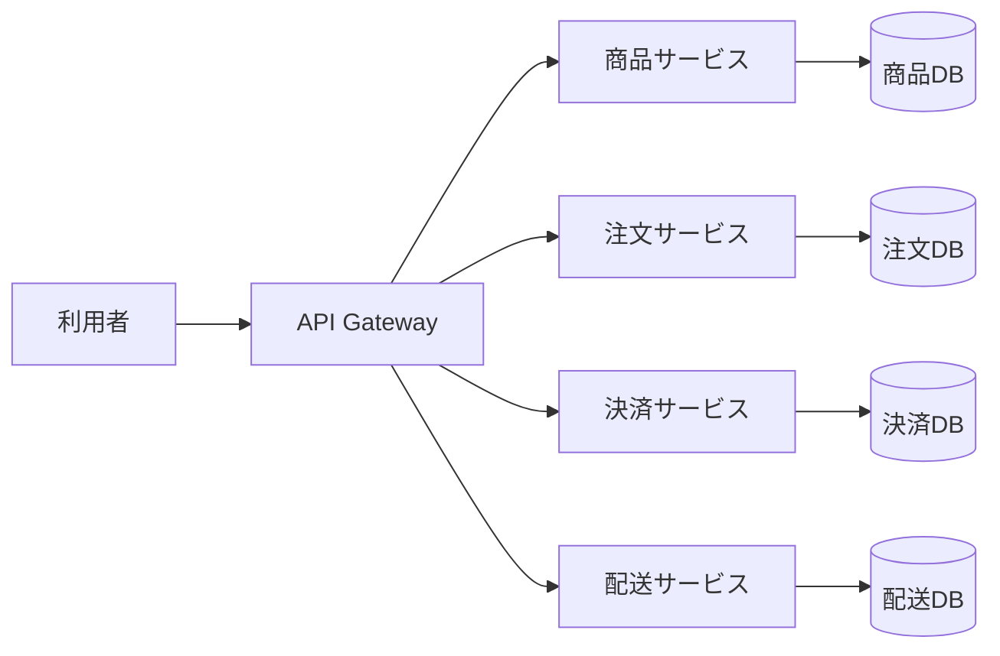
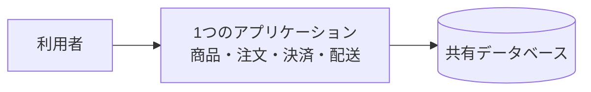
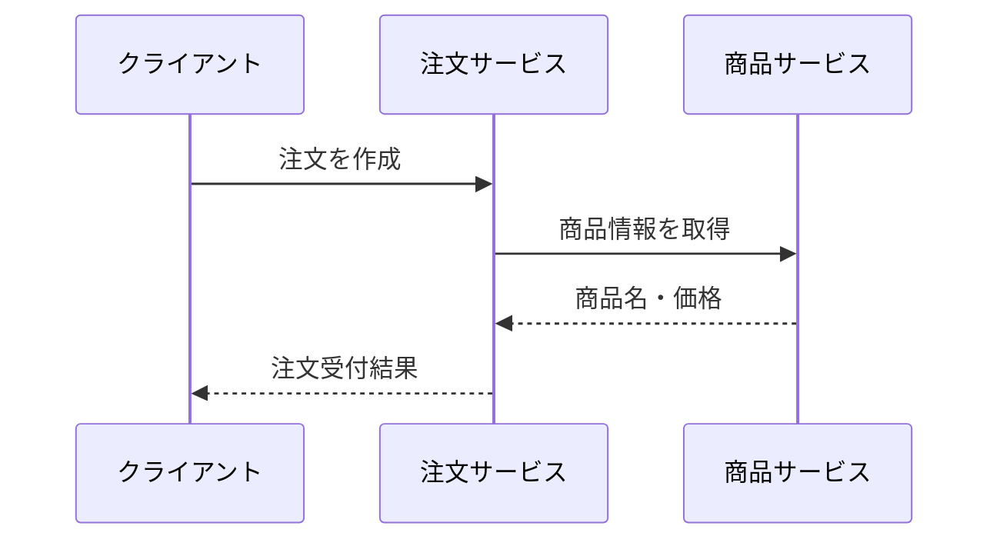
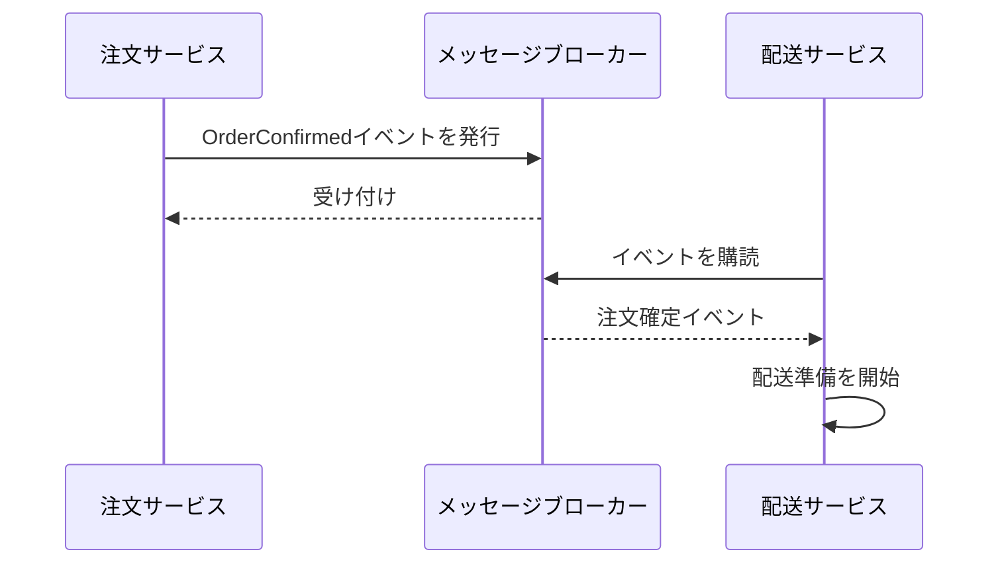
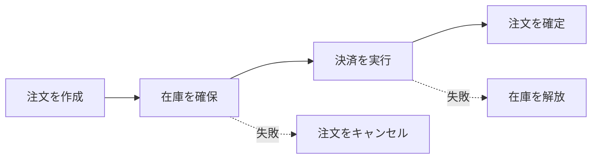
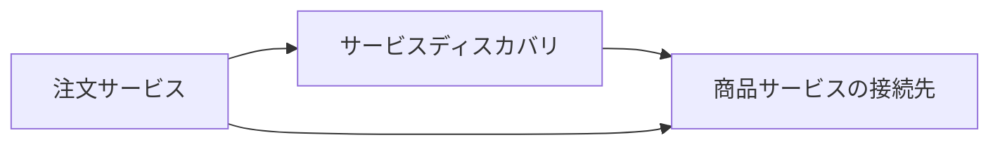
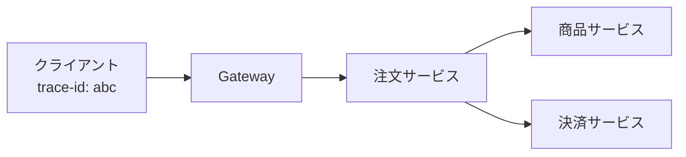

# Microservices Architecture勉強用基礎資料

## 1. Microservices Architectureとは

Microservices Architecture（マイクロサービスアーキテクチャ）は、**1つの大きなアプリケーションを、業務上の責任ごとに分けた小さなサービスの集合として作る設計方法**です。

各サービスは、特定の業務機能を担当し、次のような特徴を持ちます。

- サービスごとに責任が明確である
- サービスごとに独立して開発・テスト・デプロイしやすい
- サービス同士はAPIやメッセージで通信する
- サービスごとにデータを管理する
- 1つのサービスの障害が、全体へ広がらないように設計する

例えばネットショップを、次のように分けます。



ここでいう「小さい」とは、ソースコードの行数が少ないという意味だけではありません。
**1つの業務上の責任を持ち、チームが理解して変更できる大きさ**であることが重要です。

## 2. モノリスとの違い

モノリス（Monolith）は、複数の機能を1つのアプリケーションとしてまとめる構成です。
例えば、商品、注文、決済、配送の処理を1つのプログラムとしてデプロイします。



どちらが常に正しいというわけではありません。

| 観点 | モノリス | マイクロサービス |
| --- | --- | --- |
| 開発開始時の分かりやすさ | 構成が単純 | サービス間の考慮が必要 |
| デプロイ | 全体をまとめてデプロイ | サービスごとにデプロイ |
| スケーリング | 全体を増やすことが多い | 必要なサービスだけ増やせる |
| データ整合性 | 1つのDBで管理しやすい | サービス間の整合性が難しい |
| 障害対応 | 1つの障害が全体に影響しやすい | 障害を分離しやすいが設計が必要 |
| 運用 | 比較的少ない部品で済む | 監視・デプロイ対象が増える |

小さなシステムや学習用アプリでは、まずモノリスから始める方が理解しやすい場合があります。
マイクロサービスは、組織やシステムの複雑さが増えたときに、必要性を確認して選びます。

## 3. 身近なたとえ：専門店が集まる商店街

1つの大きな百貨店に、商品、注文、会計、配送の担当をすべて入れる構成はモノリスに似ています。

一方、商品店、注文受付店、会計店、配送店がそれぞれ独立し、必要な情報をやり取りする商店街はマイクロサービスに似ています。

| 商店街のたとえ | マイクロサービス |
| --- | --- |
| 商品店 | 商品サービス |
| 注文受付店 | 注文サービス |
| 会計店 | 決済サービス |
| 配送店 | 配送サービス |
| 店同士の依頼書や連絡 | APIやメッセージ |
| 各店の帳簿 | サービスごとのデータストア |
| 商店街の案内所 | API Gateway |

商品店が改装中でも、注文受付店が「商品を確認できない」と適切に案内できれば、商店街全体が無秩序に停止することを防げます。
このように、**分けることと、分けた後に協調できること**の両方が必要です。

## 4. サービス境界を決める

### 4.1 業務能力で分ける

サービスの境界は、技術的な画面やテーブルではなく、できるだけ**業務能力（Business Capability）**を基準に決めます。

例えば次のように考えます。

| サービス | 主な責任 |
| --- | --- |
| 商品サービス | 商品名、説明、販売価格を管理する |
| 注文サービス | 注文を作成し、注文状態を管理する |
| 決済サービス | 支払いを受け付け、結果を管理する |
| 配送サービス | 配送先と配送状況を管理する |

「商品テーブル用サービス」「注文テーブル用サービス」のように、データベースのテーブル単位で分けると、業務の責任が分かれず、サービス間の通信が増えやすくなります。

### 4.2 境界づけられたコンテキスト

DDDで学ぶ境界づけられたコンテキストは、マイクロサービスの境界を考えるときの参考になります。
同じ「商品」という言葉でも、販売サービスと配送サービスでは必要な情報が違うことがあります。

各サービスが自分の業務モデルと言葉を持つことで、他サービスの変更に引きずられにくくなります。

### 4.3 サービスを分けすぎない

サービスを細かく分けすぎると、1つの処理を実行するだけで多くのサービスへ通信することになります。

```text
悪い例：
注文 → 商品名サービス → 商品価格サービス → 在庫数サービス
```

最初は、強く関連する業務を同じサービスに置き、変更の理由やチームの責任が異なる部分から分ける方が安全です。

## 5. サービス間の通信

サービス間通信には、大きく分けて同期通信と非同期通信があります。

### 5.1 同期通信

依頼したサービスから、その場で結果を受け取る方式です。
HTTP/RESTやgRPCがよく使われます。



分かりやすい反面、呼び出し先が遅い、または停止していると、呼び出し元も待たされます。
タイムアウト、リトライ、サーキットブレーカーなどを組み合わせます。

### 5.2 非同期通信

メッセージブローカーやイベントを使い、依頼を受けたサービスが後から処理する方式です。



サービス同士を疎結合にしやすく、呼び出し先が一時的に停止しても後で処理できる場合があります。
一方で、処理がすぐに完了しないため、利用者へ「受付済み」「処理中」などの状態を伝える必要があります。

### 5.3 APIとイベントの使い分け

| 目的 | 向いている方法 |
| --- | --- |
| 今すぐ結果が必要 | 同期API |
| 後で処理できる通知 | 非同期イベント |
| 複数サービスへ同じ出来事を知らせる | イベント |
| 呼び出し先の結果で次の処理を決める | 同期APIまたはワークフロー |

通信方式を選ぶときは、「技術的に新しいか」ではなく、利用者が結果を待つ必要があるか、失敗時に再実行できるかを考えます。

## 6. データ管理と整合性

### 6.1 サービスごとにデータを所有する

マイクロサービスでは、各サービスが自分のデータを所有し、他サービスのテーブルを直接読み書きしない形を目指します。

```text
商品サービス → 商品DB
注文サービス → 注文DB
決済サービス → 決済DB
```

注文サービスが商品サービスのDBを直接参照すると、商品DBのテーブル構造変更が注文サービスへ波及します。
必要な情報はAPIやイベントを介して取得します。

### 6.2 分散トランザクションを避ける

モノリスでは、注文作成、在庫減少、決済登録を1つのトランザクションで確定できることがあります。
マイクロサービスでは、それぞれのDBが分かれるため、すべてを1回で確定することが難しくなります。

そのため、短時間だけ完全に一致するのではなく、**最終的に整合する（結果整合性）**設計を検討します。

### 6.3 Sagaパターン

Sagaは、複数サービスにまたがる処理を、各サービスのローカルトランザクションと補償処理の組み合わせで進める考え方です。



例えば決済に失敗したら、確保した在庫を戻し、注文をキャンセルします。
補償処理も失敗する可能性があるため、再実行、重複防止、運用での再処理を考えておきます。

## 7. 障害に強くするための考え方

サービスが分かれているからといって、自動的に障害に強くなるわけではありません。
ネットワーク通信は失敗するものとして設計します。

### 7.1 タイムアウト

応答を無限に待たないように、呼び出しに制限時間を設定します。
タイムアウト時間は、利用者が待てる時間と、処理の性質を考えて決めます。

### 7.2 リトライ

一時的な通信失敗にはリトライが有効です。
ただし、同じ注文を二重に作成するなどの副作用がある処理では、冪等性（同じ依頼を複数回実行しても結果が重複しない性質）を確保します。

### 7.3 サーキットブレーカー

失敗が続くサービスへの呼び出しを一時停止し、呼び出し元の資源を使い果たさないようにします。

```text
通常状態 → 失敗が続く → OPEN（呼び出しを止める）
    ↑                         ↓
    └─ 復旧確認 ← HALF-OPEN ←─
```

### 7.4 フォールバック

呼び出し先が使えない場合に、キャッシュを返す、処理を受付済みにするなど、利用者へ可能な代替結果を返します。
ただし、古い情報を返してよいか、処理を続けてよいかは業務ごとに決めます。

## 8. API Gatewayとサービスディスカバリ

### 8.1 API Gateway

API Gatewayは、外部クライアントからの入り口をまとめる部品です。

- 認証・認可
- リクエストのルーティング
- 複数サービスの結果の集約
- レート制限
- 外部向けAPIと内部サービスの分離

ただし、業務ルールをGatewayに集めすぎると、Gatewayが巨大なモノリスになります。
Gatewayは通信の入口に集中させ、業務ルールは各サービスに置きます。

### 8.2 サービスディスカバリ

サービスの台数や配置が変わる環境では、呼び出し元が固定のIPアドレスを持つのではなく、サービス名から接続先を見つけます。



クラウドやコンテナ環境では、ロードバランサー、DNS、コンテナオーケストレーターなどがこの役割を担うことがあります。

## 9. 可観測性（オブザーバビリティ）

サービスが分かれると、1つの画面操作が複数サービスを通ります。
そのため、「遅い」「失敗した」ときに、どこで問題が起きたか追跡できる仕組みが必要です。

### 9.1 ログ

サービス名、リクエストID、ユーザーや注文を識別するID、処理結果を構造化して記録します。
個人情報や決済情報を、ログへそのまま出力しないようにします。

### 9.2 メトリクス

次のような数値を測定します。

- リクエスト数
- エラー率
- 応答時間
- キューの滞留数
- CPUやメモリの使用量

### 9.3 分散トレーシング

リクエストにトレースIDを付け、サービスをまたいだ処理の流れを追跡します。



ログ、メトリクス、トレースを組み合わせることで、「どのサービスで」「何秒かかり」「なぜ失敗したか」を調べやすくなります。

## 10. デプロイとチーム構成

マイクロサービスの利点を活かすには、サービスを独立して安全にリリースできる仕組みが必要です。

```text
コード変更
   ↓
自動テスト
   ↓
コンテナイメージ作成
   ↓
ステージング環境へデプロイ
   ↓
確認・監視
   ↓
本番へ段階的にリリース
```

サービスごとに次の内容を自動化します。

- ビルド
- 単体テスト
- APIや契約のテスト
- 脆弱性チェック
- デプロイ
- ロールバック

また、チームをサービスの責任に合わせると、仕様確認から運用までの責任を明確にしやすくなります。
ただし、サービスを分けただけでチーム間の壁を作らず、API仕様、イベント、障害対応手順を共有します。

## 11. テストの考え方

サービスが増えると、すべてを結合したテストだけでは遅く、原因も分かりにくくなります。

| テスト | 確認すること |
| --- | --- |
| 単体テスト | 1つのクラスや関数のルール |
| サービス内テスト | 1サービスの処理とDB連携 |
| 契約テスト | APIの入力・出力の約束 |
| 統合テスト | メッセージブローカーや外部部品との連携 |
| E2Eテスト | 利用者の操作が全体で完了するか |

特に契約テストは、呼び出し元と呼び出し先のAPI仕様がずれていないことを、サービス全体を毎回起動せずに確認するのに役立ちます。

## 12. 簡単なAPI例

注文サービスが商品サービスへ商品情報を問い合わせる例です。

### 商品サービスのレスポンス

```json
{
  "productId": "P-001",
  "name": "ノート",
  "price": 300,
  "currency": "JPY",
  "available": true
}
```

### 注文サービスからの呼び出し例

```java
public class ProductClient {
    private final HttpClient httpClient;

    public ProductClient(HttpClient httpClient) {
        this.httpClient = httpClient;
    }

    public ProductInfo find(String productId) {
        HttpResponse response = httpClient.get("/products/" + productId);

        if (response.statusCode() == 404) {
            throw new ProductNotFoundException(productId);
        }
        if (response.statusCode() >= 500) {
            throw new ProductServiceUnavailableException();
        }
        return ProductInfo.from(response.body());
    }
}
```

実際には、URLの組み立て、タイムアウト、リトライ、認証、レスポンス形式の検証、ログ出力なども必要です。
外部サービスの応答を、注文サービスの業務モデルへそのまま混ぜず、`ProductClient`のような境界で変換すると変更に対応しやすくなります。

## 13. 利点

### 13.1 独立してデプロイしやすい

配送サービスだけを変更し、商品サービスを再デプロイせずにリリースできる可能性があります。

### 13.2 必要な部分だけ拡張できる

セール中に注文サービスの負荷だけが増える場合、注文サービスを重点的にスケールできます。

### 13.3 技術を選びやすい

サービスの責任に合わせて、適した言語やデータストアを選べます。
ただし、技術が増えるほど学習・運用コストも増えるため、理由を説明できる選択にします。

### 13.4 障害の影響範囲を限定しやすい

適切なタイムアウトやフォールバックがあれば、配送状況が一時的に見られなくても、注文履歴の表示は続けるといった設計ができます。

## 14. 注意点とよくある失敗

### 14.1 分割すればよいと考える

サービス間の通信、データ整合性、監視、デプロイが必要になるため、マイクロサービスはモノリスより簡単とは限りません。

### 14.2 共有DBを使い続ける

複数サービスが同じテーブルを直接更新すると、サービスの独立性が失われます。
短期的な移行段階では共有DBを使うこともありますが、所有者と移行計画を決めます。

### 14.3 1つの処理を細かく分割しすぎる

通信回数が増えると、遅延や障害の可能性が増えます。
サービス境界は、業務上の責任と変更の単位を基準にします。

### 14.4 分散トランザクションを隠す

注文、在庫、決済をすべて即時に成功させる前提で作ると、障害時の復旧が難しくなります。
処理中・失敗・補償済みなどの状態をモデルに含めます。

### 14.5 監視を後回しにする

サービスが増えてからログやトレースを追加すると、障害の原因を追うのが困難になります。
最初からリクエストID、エラー率、応答時間を確認できるようにします。

### 14.6 マイクロサービスから始める

要件や業務境界がまだ分かっていない段階で分割すると、後で境界を作り直すコストが高くなります。
まずモジュール化したモノリスを作り、境界が見えてからサービスを分ける方法も有効です。

## 15. Layered ArchitectureやDDDとの関係

これらは競合する考え方ではなく、異なる問題を整理します。

| 考え方 | 主な問い |
| --- | --- |
| Microservices Architecture | アプリケーションをどのサービスに分けるか |
| Layered Architecture | 1つのサービス内の責任をどう分けるか |
| DDD | 業務の言葉とルールをどうモデル化するか |
| MVC | ユーザーとの入出力をどう整理するか |

例えば、注文サービスの内部を次のように構成できます。

```text
注文サービス
├─ Presentation Layer
│  └─ OrderController
├─ Application Layer
│  └─ CreateOrderUseCase
├─ Domain Layer
│  └─ Order、OrderLine、注文ルール
└─ Infrastructure Layer
   └─ OrderRepository、ProductClient
```

サービスの境界をDDDで考え、サービス内部をLayered Architectureで整理する構成です。

## 16. 学習を始める手順

1. まずモノリスで、対象業務の処理の流れを実装する
2. 業務上の責任と変更理由を書き出す
3. サービスの候補と、各サービスが所有するデータを決める
4. 同期APIと非同期イベントの境界を決める
5. タイムアウト、再試行、冪等性、補償処理を設計する
6. ログ、メトリクス、トレースを追加する
7. 小さな範囲を分離し、独立デプロイと障害対応を試す

最初の題材としては、商品サービスと注文サービスの2つから始めると、サービス境界、API、データ所有、エラー処理を学びやすくなります。

## 17. まとめ

Microservices Architectureは、業務上の責任ごとにアプリケーションを複数のサービスへ分ける設計方法です。

```text
サービス境界       = 業務能力と変更の単位で決める
サービス間通信     = APIやイベントで行う
データ管理         = 各サービスが自分のデータを所有する
整合性             = 結果整合性やSagaを検討する
障害対応           = タイムアウト、再試行、冪等性、補償処理を設計する
運用               = ログ、メトリクス、トレース、CI/CDを用意する
```

覚えておきたいポイントは次の3つです。

1. 小さく分けることよりも、業務上の責任を明確にすることが大切
2. サービス間のネットワーク、データ整合性、障害を必ず設計する
3. マイクロサービスは目的ではなく、独立した変更や拡張が必要なときの手段である

まずはモノリスの中で業務境界を整理し、必要な部分から段階的に分けると、マイクロサービスの複雑さをコントロールしやすくなります。
